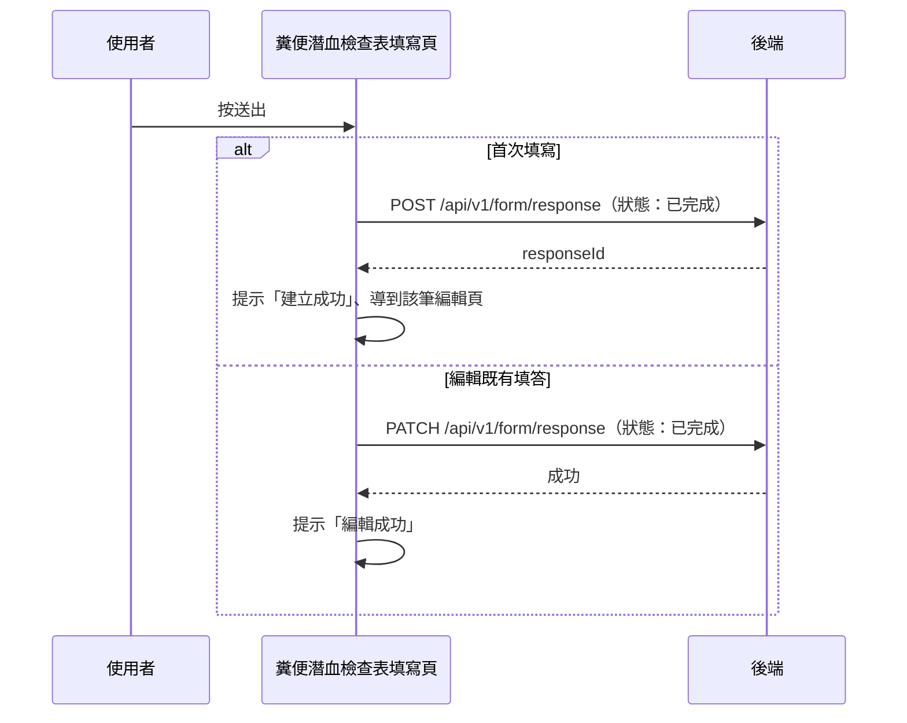

## 送出糞便潛血檢查表

**觸發**：糞便潛血檢查表填寫頁按「送出」（子表單元件發出 `submit` 事件）
`src/components/Form/CustomForm/FecalOccultBlood/IndexView.vue:377`

客製量表共同骨架的最單純版本：沒有暫存、沒有送出前整理，一律以「已完成」寫入。

### 步驟

1. **依頁面模式建立或更新填答，狀態為「已完成」**
   `src/components/Form/CustomForm/FecalOccultBlood/IndexView.vue:268-279`
   - 首次填寫 → `POST /api/v1/form/response`（**寫入**） `src/api/form.ts:318`，
     成功後提示「建立成功」、`router.replace` 到該筆編輯頁（FormResponseEdit）
     `src/components/Form/CustomForm/FecalOccultBlood/IndexView.vue:295-296`——
     之後再儲存走更新，不會重複建立。
   - 編輯既有填答 → `PATCH /api/v1/form/response`（**寫入**） `src/api/form.ts:349`，
     成功後提示「編輯成功」、把結果寫回本地狀態。

   期間掛上載入狀態。

### 序列圖

### 資料變化

| 對象 | 動作 | 位置 |
|---|---|---|
| `POST /api/v1/form/response` | **寫入**，建立填答 | `src/api/form.ts:318` |
| `PATCH /api/v1/form/response` | **寫入**，更新填答 | `src/api/form.ts:349` |
| 導頁 | 建立成功後轉到 FormResponseEdit | `src/components/Form/CustomForm/FecalOccultBlood/IndexView.vue:296` |
| 提示 Store | 建立／編輯成功訊息 | `src/components/Form/CustomForm/FecalOccultBlood/IndexView.vue:295` |
| 載入 Store | 掛上與解除 | `src/components/Form/CustomForm/FecalOccultBlood/IndexView.vue:270` |

### 異常與補償

- 建立與更新都有 `catch`：失敗時顯示「表單已關閉」提示視窗
  `src/components/Form/CustomForm/FecalOccultBlood/IndexView.vue:322-325`，
  確認後回上一頁；載入狀態因錯誤已被接住而正常解除；
  全域攔截器的錯誤提示仍會出現（見全域前置）。

### 全域前置

授權標頭注入與錯誤顯示見〈每個請求送出前〉與〈API 錯誤的全域處理〉。
