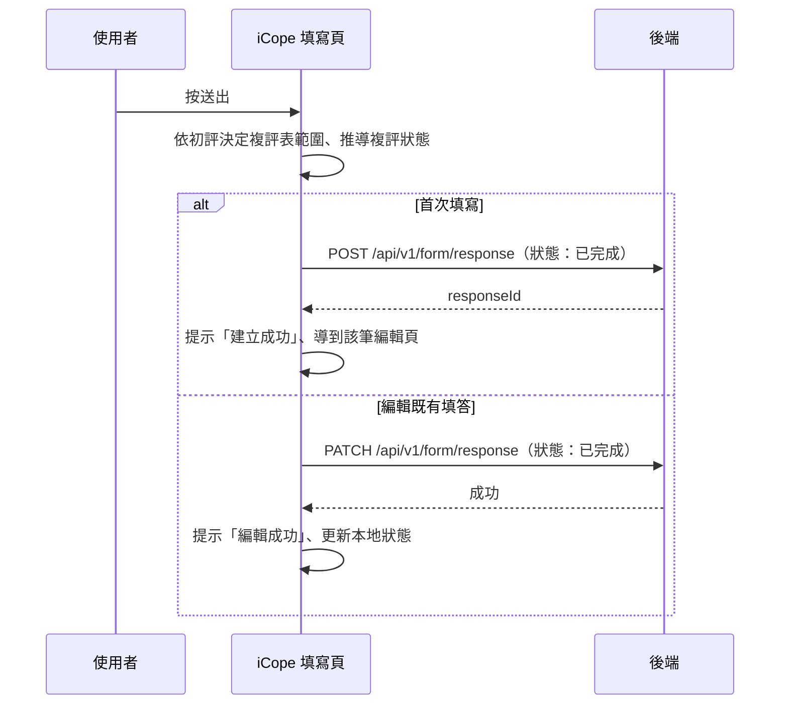

## 送出 iCope 評估表

**觸發**：iCope 評估表填寫頁按「送出」（子表單元件發出 `submit` 事件）
`src/components/Form/CustomForm/ICope/IndexView.vue:713`

### 步驟

1. **依初評結果決定哪些複評表要算** `src/components/Form/CustomForm/ICope/IndexView.vue:441-458`
   純前端規則：從初評表的記憶、行動、營養、情緒、視聽力等測項結果，
   判斷 BHT/AD8、SPPB、MNA、GDS、用藥與社會照護評估哪些是「需要填」的複評表；
   **不需要填的複評表內容直接清成預設值**，避免殘留舊資料。

2. **推導複評狀態與完成時間** `src/components/Form/CustomForm/ICope/IndexView.vue:460-493`
   需要填卻沒填完 → 複評狀態「未完成」；都不需要填 → 狀態為空；
   需要填且都填完 → 狀態「完成」，完成時間取**最新**的那張複評表時間。
   縣市欄位由名稱轉代碼 `src/components/Form/CustomForm/ICope/IndexView.vue:496-498`。

3. **依頁面模式建立或更新填答，狀態為「已完成」** `src/components/Form/CustomForm/ICope/IndexView.vue:501-508`
   - 首次填寫 → `POST /api/v1/form/response`（**寫入**，API 層 try 只原樣拋回）
     `src/api/form.ts:318`，成功後顯示「建立成功」並 `router.replace` 到該筆的
     編輯頁（FormResponseEdit，帶回 `responseId`）
     `src/components/Form/CustomForm/ICope/IndexView.vue:552-553`——
     之後再儲存就走更新，不會重複建立。
   - 編輯既有填答 → `PATCH /api/v1/form/response`（**寫入**） `src/api/form.ts:349`，
     成功後顯示「編輯成功」、把結果寫回本地狀態（縣市代碼轉回名稱）。

   整段期間掛著載入狀態。

### 序列圖

### 資料變化

| 對象 | 動作 | 位置 |
|---|---|---|
| `POST /api/v1/form/response` | **寫入**，建立填答（狀態：已完成） | `src/api/form.ts:318` |
| `PATCH /api/v1/form/response` | **寫入**，更新填答（狀態：已完成） | `src/api/form.ts:349` |
| 導頁 | 建立成功後轉到 FormResponseEdit | `src/components/Form/CustomForm/ICope/IndexView.vue:553` |
| 提示 Store | 建立／編輯成功訊息 | `src/components/Form/CustomForm/ICope/IndexView.vue:552` |
| 載入 Store | 掛上與解除 | `src/components/Form/CustomForm/ICope/IndexView.vue:439` |

### 異常與補償

- 建立與更新都有 `catch`：失敗時顯示「表單已關閉」提示視窗
  `src/components/Form/CustomForm/ICope/IndexView.vue:636-639`，
  使用者按確認後 `router.back()` 回上一頁。因為錯誤被接住，載入狀態會正常解除。
- 全域攔截器的錯誤提示仍會出現（見全域前置）。

### 全域前置

授權標頭注入與錯誤顯示見〈每個請求送出前〉與〈API 錯誤的全域處理〉。
