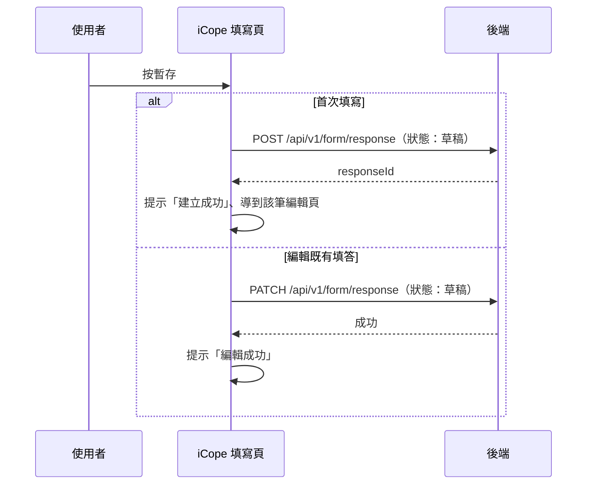

## 暫存 iCope 評估表

**觸發**：iCope 評估表填寫頁按「暫存」（子表單元件發出 `temporary` 事件）
`src/components/Form/CustomForm/ICope/IndexView.vue:714`

與〈送出 iCope 評估表〉走同兩支 API，關鍵差異：**狀態送「草稿」而非「已完成」**，
且**跳過**送出前的複評表整理（不清空不需要的複評表、不推導複評狀態）——
暫存要保留使用者填到一半的原樣。

### 步驟

1. **只做縣市名稱轉代碼** `src/components/Form/CustomForm/ICope/IndexView.vue:521-524`
   不做任何複評表清理與狀態推導。

2. **依頁面模式建立或更新填答，狀態為「草稿」** `src/components/Form/CustomForm/ICope/IndexView.vue:526-533`
   - 首次填寫 → `POST /api/v1/form/response`（**寫入**） `src/api/form.ts:318`，
     成功後顯示「建立成功」、`router.replace` 到該筆編輯頁（之後的暫存走更新）。
   - 編輯既有填答 → `PATCH /api/v1/form/response`（**寫入**） `src/api/form.ts:349`，
     成功後顯示「編輯成功」。

   整段期間掛著載入狀態。

### 序列圖

### 資料變化

| 對象 | 動作 | 位置 |
|---|---|---|
| `POST /api/v1/form/response` | **寫入**，建立填答（狀態：草稿） | `src/api/form.ts:318` |
| `PATCH /api/v1/form/response` | **寫入**，更新填答（狀態：草稿） | `src/api/form.ts:349` |
| 導頁 | 建立成功後轉到 FormResponseEdit | `src/components/Form/CustomForm/ICope/IndexView.vue:553` |
| 提示 Store | 建立／編輯成功訊息 | `src/components/Form/CustomForm/ICope/IndexView.vue:552` |
| 載入 Store | 掛上與解除 | `src/components/Form/CustomForm/ICope/IndexView.vue:519` |

### 異常與補償

同〈送出 iCope 評估表〉：建立與更新都有 `catch`，失敗時顯示「表單已關閉」視窗，
確認後回上一頁；載入狀態正常解除；全域攔截器的錯誤提示仍會出現。

### 全域前置

授權標頭注入與錯誤顯示見〈每個請求送出前〉與〈API 錯誤的全域處理〉。
