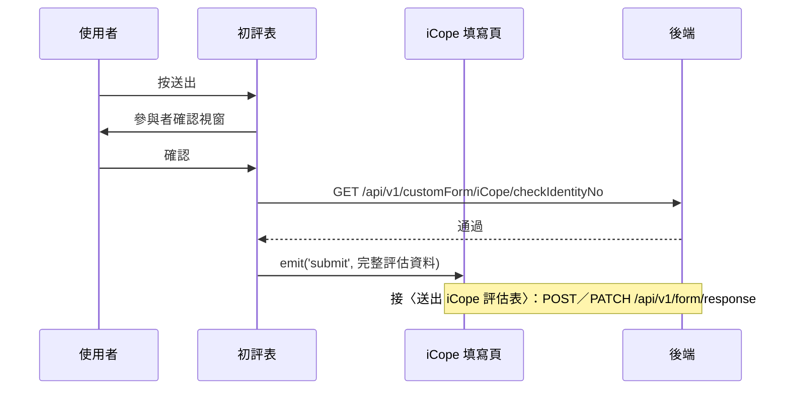

## 送出 iCope 初評表（先檢核身分證號）

**觸發**：iCope 初評表按「送出」
`src/components/Form/CustomForm/ICope/InitialAssessmentForm.vue:1142`

初評表送出前有一道**後端身分證檢核**——通過了才把整份資料往上交給填寫頁寫入。

### 步驟

1. **表單驗證與確認視窗** `src/components/Form/CustomForm/ICope/InitialAssessmentForm.vue:352-362`
   `handleSubmit` 驗證通過後（驗證失敗會捲動到第一個錯誤欄位），
   跳出參與者確認視窗；按取消就中止。

2. **組出完整評估資料** `src/components/Form/CustomForm/ICope/InitialAssessmentForm.vue:364-378`
   補上建立／更新時間與人員（取自登入者）、標記初評「已完成」，
   併入其他複評表的現況 `src/components/Form/CustomForm/ICope/InitialAssessmentForm.vue:459-474`。

3. **向後端檢核身分證號** `src/components/Form/CustomForm/ICope/InitialAssessmentForm.vue:380-387`
   缺身分證或表單 ID 直接中止。帶身分證、表單、年度與（編輯時的）`responseId`
   → `GET /api/v1/customForm/iCope/checkIdentityNo`（讀取） `src/api/form.ts:557`。
   **通過才 `emit('submit', 資料)`** 往上交給填寫頁——後續接〈送出 iCope 評估表〉
   （建立或更新填答）。期間掛上載入狀態。

### 序列圖

### 資料變化

| 對象 | 動作 | 位置 |
|---|---|---|
| `GET /api/v1/customForm/iCope/checkIdentityNo` | 唯讀，檢核身分證號 | `src/api/form.ts:557` |
| 載入 Store | 掛上與解除 | `src/components/Form/CustomForm/ICope/InitialAssessmentForm.vue:386` |

### 異常與補償

- 檢核沒有 try／catch，失敗（例如身分證重複或不合法）由全域 API 回應攔截器顯示錯誤
  （見全域前置）；**不發 submit**，填寫頁不會寫入，使用者可修正後重試。
  「解除載入狀態」在 `await` 之後，失敗時依賴攔截器安全網。

### 全域前置

授權標頭注入與錯誤顯示見〈每個請求送出前〉與〈API 錯誤的全域處理〉。
