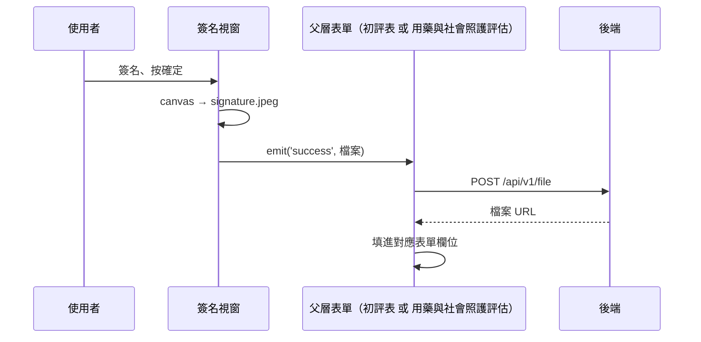

## 上傳電子簽名（iCope）

**觸發**：iCope 的「簽名」視窗簽完後按確定
`src/components/Form/CustomForm/ICope/components/SignatureModal.vue:190`

### 步驟

1. **把畫布轉成圖片檔** `src/components/Form/CustomForm/ICope/components/SignatureModal.vue:150-158`
   關窗後把 canvas 內容轉成 `signature.jpeg`，轉檔成功才 `emit('success', 檔案)`。
   沒有畫布或轉檔失敗就什麼都不發。

2. **父層上傳簽名檔** —— 這個簽名視窗被**兩個父層**共用，各自把回傳的檔案 URL
   填進不同欄位：
   - 初評表 `src/components/Form/CustomForm/ICope/InitialAssessmentForm.vue:528-540`
     → 填進「電子簽名」欄位
   - 用藥與社會照護評估 `src/components/Form/CustomForm/ICope/MedicationAndSocialCareAssessment.vue:212-224`
     → 填進「機構名稱與代碼」欄位

   兩邊都是 `POST /api/v1/file`（**寫入**） `src/api/file.ts:10`，
   期間顯示各自的簽名載入狀態。

3. **URL 只存在表單欄位裡**——真正寫進填答資料，要等整份評估表送出或暫存。

### 序列圖

### 資料變化

| 對象 | 動作 | 位置 |
|---|---|---|
| `POST /api/v1/file` | **寫入**，上傳簽名圖檔 | `src/api/file.ts:10` |
| 表單欄位 | 寫入回傳的檔案 URL | `src/components/Form/CustomForm/ICope/InitialAssessmentForm.vue:539` |

### 異常與補償

- 上傳失敗被 `catch` 化為空字串
  `src/components/Form/CustomForm/ICope/InitialAssessmentForm.vue:534`——
  **欄位會被填成空值**，流程不中斷；全域攔截器的錯誤提示仍會出現。
  使用者需要重新簽名上傳。

### 全域前置

授權標頭注入與錯誤顯示見〈每個請求送出前〉與〈API 錯誤的全域處理〉。
