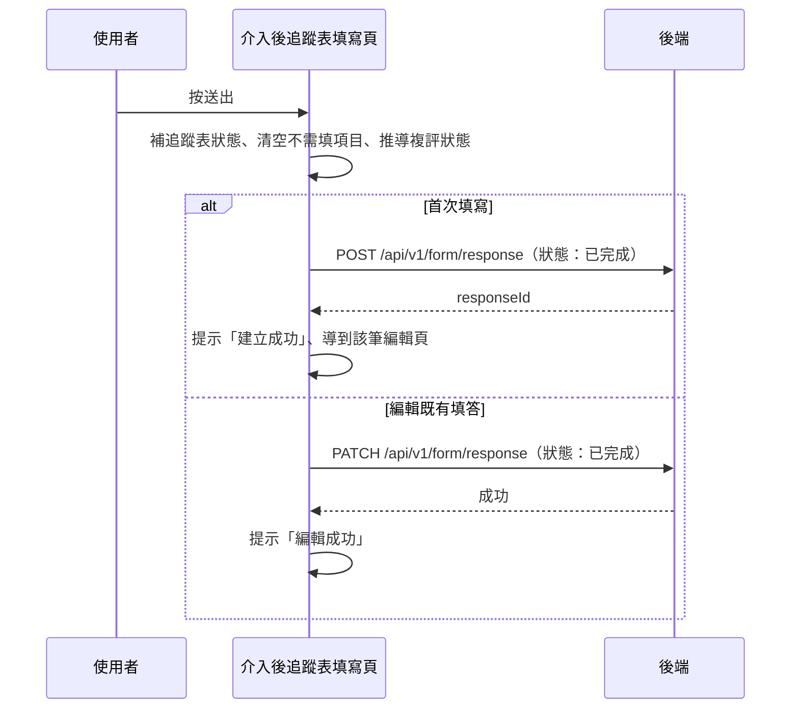

## 送出 iCope 介入後追蹤表

**觸發**：iCope 介入後追蹤表填寫頁按「送出」（子表單元件發出 `submit` 事件）
`src/components/Form/CustomForm/ICopePostInterventionFollowUp/IndexView.vue:764`

結構與〈送出 iCope 評估表〉同型：前端整理 → 依模式建立或更新填答（狀態「已完成」）。

### 步驟

1. **自動補追蹤表狀態** `src/components/Form/CustomForm/ICopePostInterventionFollowUp/IndexView.vue:532-536`
   介入計畫已完成、追蹤表狀態還是空 → 自動標成「未完成」。

2. **清空不需要填的評估項目、推導複評狀態**
   `src/components/Form/CustomForm/ICopePostInterventionFollowUp/IndexView.vue:539-571`
   認知（BHT/AD8）、行動（SPPB）、營養（MNA）、憂鬱（GDS）、用藥與社會照護評估，
   不需要的清成預設值；有必填未完成 → 複評「未完成」；都不需要 → 空；
   都完成 → 「完成」並取最新完成時間。

3. **依頁面模式建立或更新填答，狀態為「已完成」**
   `src/components/Form/CustomForm/ICopePostInterventionFollowUp/IndexView.vue:513-522`
   - 首次填寫 → `POST /api/v1/form/response`（**寫入**） `src/api/form.ts:318`，
     成功後提示「建立成功」、`router.replace` 到該筆編輯頁（FormResponseEdit）
     `src/components/Form/CustomForm/ICopePostInterventionFollowUp/IndexView.vue:631-632`。
   - 編輯既有填答 → `PATCH /api/v1/form/response`（**寫入**） `src/api/form.ts:349`，
     成功後提示「編輯成功」、把結果寫回本地狀態。

   整段以 `try…finally` 包裹，**載入狀態成功失敗都會解除**
   `src/components/Form/CustomForm/ICopePostInterventionFollowUp/IndexView.vue:527`。

### 序列圖

### 資料變化

| 對象 | 動作 | 位置 |
|---|---|---|
| `POST /api/v1/form/response` | **寫入**，建立填答（狀態：已完成） | `src/api/form.ts:318` |
| `PATCH /api/v1/form/response` | **寫入**，更新填答（狀態：已完成） | `src/api/form.ts:349` |
| 導頁 | 建立成功後轉到 FormResponseEdit | `src/components/Form/CustomForm/ICopePostInterventionFollowUp/IndexView.vue:632` |
| 提示 Store | 建立／編輯成功訊息 | `src/components/Form/CustomForm/ICopePostInterventionFollowUp/IndexView.vue:631` |
| 載入 Store | 掛上與解除（`finally`） | `src/components/Form/CustomForm/ICopePostInterventionFollowUp/IndexView.vue:508` |

### 異常與補償

- 建立與更新都有 `catch`：失敗時顯示「表單已關閉」提示視窗
  `src/components/Form/CustomForm/ICopePostInterventionFollowUp/IndexView.vue:676-679`，
  確認後回上一頁；全域攔截器的錯誤提示仍會出現（見全域前置）。
- 載入狀態在 `finally` 解除，任何路徑都不會殘留。

### 全域前置

授權標頭注入與錯誤顯示見〈每個請求送出前〉與〈API 錯誤的全域處理〉。
