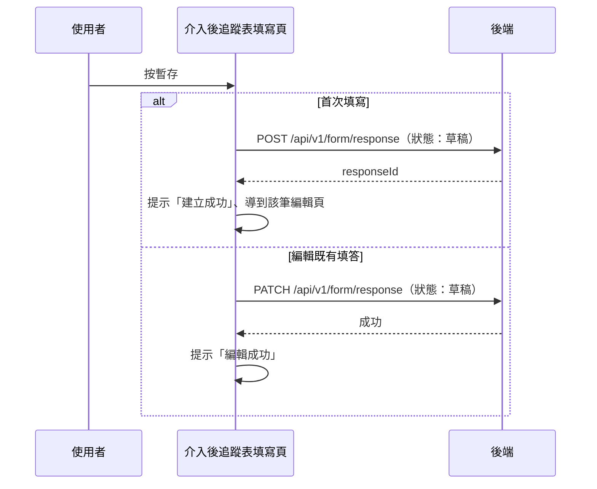

## 暫存 iCope 介入後追蹤表

**觸發**：iCope 介入後追蹤表填寫頁按「暫存」（子表單元件發出 `temporary` 事件）
`src/components/Form/CustomForm/ICopePostInterventionFollowUp/IndexView.vue:765`

與〈送出 iCope 介入後追蹤表〉走同兩支 API，關鍵差異：**狀態送「草稿」**，
且**跳過**送出前的整理（不補追蹤表狀態、不清空項目、不推導複評狀態），
保留使用者填到一半的原樣。

### 步驟

1. **依頁面模式建立或更新填答，狀態為「草稿」**
   `src/components/Form/CustomForm/ICopePostInterventionFollowUp/IndexView.vue:601-613`
   - 首次填寫 → `POST /api/v1/form/response`（**寫入**） `src/api/form.ts:318`，
     成功後提示「建立成功」、`router.replace` 到該筆編輯頁（之後的暫存走更新）
     `src/components/Form/CustomForm/ICopePostInterventionFollowUp/IndexView.vue:631-632`。
   - 編輯既有填答 → `PATCH /api/v1/form/response`（**寫入**） `src/api/form.ts:349`，
     成功後提示「編輯成功」。

   期間掛上載入狀態。

### 序列圖

### 資料變化

| 對象 | 動作 | 位置 |
|---|---|---|
| `POST /api/v1/form/response` | **寫入**，建立填答（狀態：草稿） | `src/api/form.ts:318` |
| `PATCH /api/v1/form/response` | **寫入**，更新填答（狀態：草稿） | `src/api/form.ts:349` |
| 導頁 | 建立成功後轉到 FormResponseEdit | `src/components/Form/CustomForm/ICopePostInterventionFollowUp/IndexView.vue:632` |
| 提示 Store | 建立／編輯成功訊息 | `src/components/Form/CustomForm/ICopePostInterventionFollowUp/IndexView.vue:631` |
| 載入 Store | 掛上與解除 | `src/components/Form/CustomForm/ICopePostInterventionFollowUp/IndexView.vue:603` |

### 異常與補償

同〈送出 iCope 介入後追蹤表〉：建立與更新都有 `catch`，失敗時顯示「表單已關閉」視窗，
確認後回上一頁；全域攔截器的錯誤提示仍會出現。
（注意：與送出不同，這裡的載入解除不在 `finally`，但因錯誤已被 catch 接住，仍會執行。）

### 全域前置

授權標頭注入與錯誤顯示見〈每個請求送出前〉與〈API 錯誤的全域處理〉。
