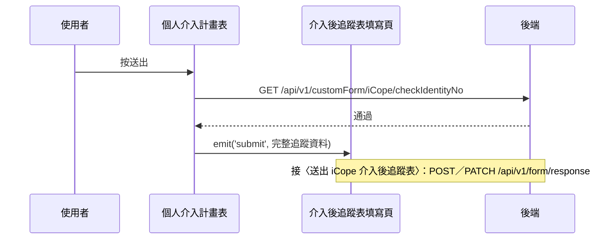

## 送出個人介入計畫（先檢核身分證號）

**觸發**：iCope 介入後追蹤的「個人介入計畫」表按送出
`src/components/Form/CustomForm/ICopePostInterventionFollowUp/PersonalInterventionPlanForm.vue:510`

與〈送出 iCope 初評表〉同一個模式：先過後端身分證檢核，通過才把資料往上交。

### 步驟

1. **表單驗證、組出完整追蹤資料**
   `src/components/Form/CustomForm/ICopePostInterventionFollowUp/PersonalInterventionPlanForm.vue:216-252`
   `handleSubmit` 驗證通過後（失敗會捲動到第一個錯誤欄位），把介入計畫各面向
   （認知、行動、營養、視聽力、憂鬱、社會、用藥）連同建立／更新時間與人員組好，
   標記介入計畫「已完成」，併入其他表的現況。

2. **向後端檢核身分證號**
   `src/components/Form/CustomForm/ICopePostInterventionFollowUp/PersonalInterventionPlanForm.vue:254-263`
   缺身分證或表單 ID 直接中止。帶身分證、表單、年度與（編輯時的）`responseId`
   → `GET /api/v1/customForm/iCope/checkIdentityNo`（讀取） `src/api/form.ts:557`。
   **通過才 `emit('submit', 資料)`**——後續接〈送出 iCope 介入後追蹤表〉
   （建立或更新填答）。期間掛上載入狀態。

### 序列圖

### 資料變化

| 對象 | 動作 | 位置 |
|---|---|---|
| `GET /api/v1/customForm/iCope/checkIdentityNo` | 唯讀，檢核身分證號 | `src/api/form.ts:557` |
| 載入 Store | 掛上與解除 | `src/components/Form/CustomForm/ICopePostInterventionFollowUp/PersonalInterventionPlanForm.vue:262` |

### 異常與補償

- 檢核沒有 try／catch，失敗由全域 API 回應攔截器顯示錯誤（見全域前置）；
  **不發 submit**，不會寫入，可修正後重試。
  「解除載入狀態」在 `await` 之後，失敗時依賴攔截器安全網。

### 全域前置

授權標頭注入與錯誤顯示見〈每個請求送出前〉與〈API 錯誤的全域處理〉。
