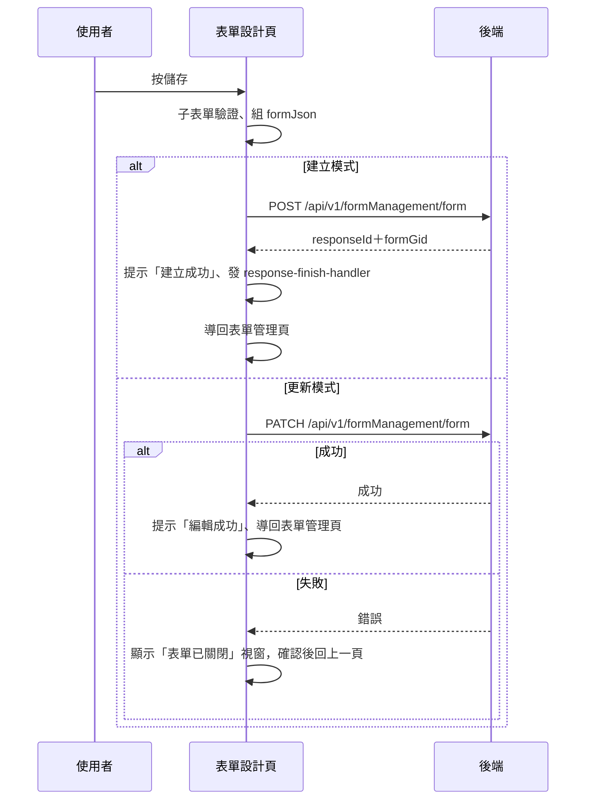

## 儲存表單設計（建立或更新表單）

**觸發**：表單設計頁按「儲存」
`src/components/Form/CustomForm/IndexView.vue:319`

〈建立自訂表單〉的資格檢查通過後，使用者在這頁設計表單內容；按儲存才真正把表單
寫進後端。同一顆按鈕依頁面模式分成**建立**與**更新**兩條路。

### 步驟

1. **子表單驗證** `src/components/Form/CustomForm/IndexView.vue:171`
   子元件有提供 `getIsValid` 就先驗，未通過直接擋下，不打後端。

2. **依表單分類向子元件取得 formJson** `src/components/Form/CustomForm/IndexView.vue:189-200`
   iCope、iCope 介入後追蹤、OpenLab、精神急症應變系統四類各有專屬的取值方法，
   其餘分類 `formJson` 為空字串。表單標題會先去頭尾空白。

3. **建立模式：送出新表單** `src/components/Form/CustomForm/IndexView.vue:213-227`
   帶機構、分類、formJson、標題、描述與公開／匿名等旗標
   → `POST /api/v1/formManagement/form`（**寫入**，API 層 try 只原樣拋回） `src/api/form.ts:232`。
   成功後顯示「建立成功」、發 `response-finish-handler` 事件（帶回 `responseId` 與
   `formGid`），非內嵌模式（`noUseRouter` 未開）就 `router.replace` 回表單管理頁。

4. **更新模式：送出修改** `src/components/Form/CustomForm/IndexView.vue:241-264`
   帶 `formGid` 與同一組欄位
   → `PATCH /api/v1/formManagement/form`（**寫入**，API 層 try 只原樣拋回） `src/api/form.ts:278`。
   成功後顯示「編輯成功」、`router.replace` 回表單管理頁。

   整段期間掛著載入狀態 `src/components/Form/CustomForm/IndexView.vue:174`。

### 序列圖

### 資料變化

| 對象 | 動作 | 位置 |
|---|---|---|
| `POST /api/v1/formManagement/form` | **寫入**，建立表單 | `src/api/form.ts:232` |
| `PATCH /api/v1/formManagement/form` | **寫入**，更新表單 | `src/api/form.ts:278` |
| 提示 Store | 建立／編輯成功訊息 | `src/components/Form/CustomForm/IndexView.vue:222` |
| 導頁 | 成功後回 FormManagement | `src/components/Form/CustomForm/IndexView.vue:227` |
| 載入 Store | 掛上與解除 | `src/components/Form/CustomForm/IndexView.vue:174` |

### 異常與補償

- **建立失敗**：沒有元件層 catch，錯誤由全域 API 回應攔截器顯示；不發事件、不導頁，
  `await` 中斷後「解除載入狀態」不會執行，依賴攔截器安全網。
- **更新失敗**：有專屬補償 `src/components/Form/CustomForm/IndexView.vue:263`——
  顯示「表單已關閉」提示視窗 `src/components/Form/CustomForm/IndexView.vue:270-273`，
  使用者按確認後 `router.back()` 回上一頁。因為錯誤被 catch 接住，
  載入狀態會正常解除。

### 未追蹤的部分

- `emit('response-finish-handler')` `src/components/Form/CustomForm/IndexView.vue:224`
  的父層 listener 封包未解析到（本元件被多個頁面以不同方式掛載），
  建立成功後父層接手做什麼未追蹤。

### 全域前置

授權標頭注入與錯誤顯示見〈每個請求送出前〉與〈API 錯誤的全域處理〉。
