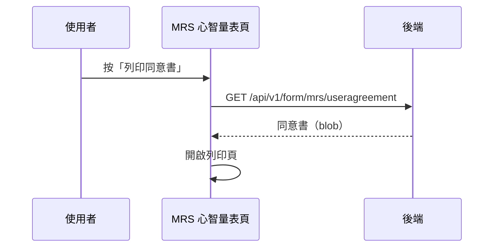

## 列印 MRS 受檢者同意書

**觸發**：MRS 心智量表頁按「列印同意書」
`src/components/Form/CustomForm/MrsMental/IndexView.vue:562`

### 步驟

1. **向後端取得同意書檔案** `src/components/Form/CustomForm/MrsMental/IndexView.vue:447-450`
   → `GET /api/v1/form/mrs/useragreement`（讀取，回傳 blob） `src/api/form.ts:446`。
   期間掛上載入狀態。

2. **開啟列印頁** `src/components/Form/CustomForm/MrsMental/IndexView.vue:451`
   把 blob 交給 `openPrintPage`，開啟瀏覽器列印。

### 序列圖

### 資料變化

| 對象 | 動作 | 位置 |
|---|---|---|
| `GET /api/v1/form/mrs/useragreement` | 唯讀 | `src/api/form.ts:446` |
| 瀏覽器 | 開啟列印頁 | `src/components/Form/CustomForm/MrsMental/IndexView.vue:451` |
| 載入 Store | 掛上與解除 | `src/components/Form/CustomForm/MrsMental/IndexView.vue:448` |

### 異常與補償

- 沒有 try／catch，失敗由全域 API 回應攔截器統一顯示錯誤（見全域前置）；
  失敗時不開列印頁，「解除載入狀態」在 `await` 之後，依賴攔截器安全網。

### 全域前置

授權標頭注入與錯誤顯示見〈每個請求送出前〉與〈API 錯誤的全域處理〉。
