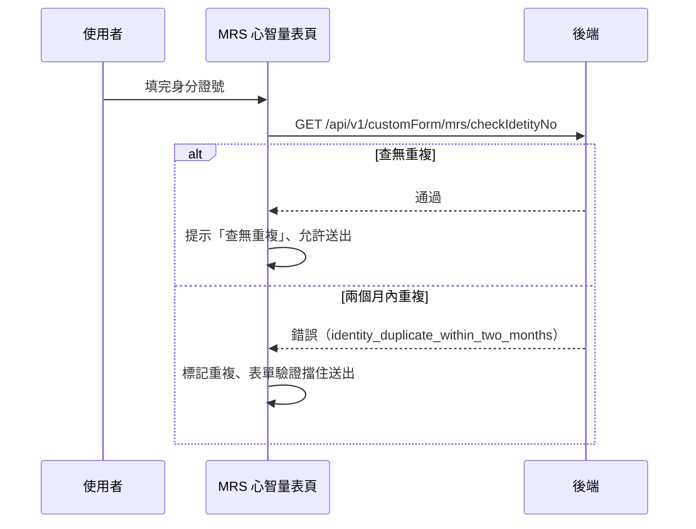

## 檢核 MRS 身分證號是否兩個月內重複

**觸發**：MRS 心智量表頁的身分證欄位輸入完成（change）
`src/components/Form/CustomForm/MrsMental/IndexView.vue:646`

即時檢核：填完身分證就先問後端「兩個月內是否做過」，不等送出才發現。

### 步驟

1. **前端先擋格式錯誤** `src/components/Form/CustomForm/MrsMental/IndexView.vue:410-412`
   身分證欄位有格式錯誤、或已有檢核結果時直接略過。

2. **向後端檢核** `src/components/Form/CustomForm/MrsMental/IndexView.vue:414-426`
   帶身分證號 → `GET /api/v1/customForm/mrs/checkIdetityNo`（讀取） `src/api/case.ts:62`，
   期間顯示欄位層級的檢核中狀態。
   - **通過**：顯示「查無重複」提示，標記可送出。
   - **失敗**：`catch` 讀取錯誤訊息清單，若含
     `identity_duplicate_within_two_months` 就標記「兩個月內重複」並重跑表單驗證，
     擋住送出。

### 序列圖

### 資料變化

| 對象 | 動作 | 位置 |
|---|---|---|
| `GET /api/v1/customForm/mrs/checkIdetityNo` | 唯讀，重複檢核 | `src/api/case.ts:62` |
| 提示 Store | 「查無重複」訊息 | `src/components/Form/CustomForm/MrsMental/IndexView.vue:418` |

### 異常與補償

- 錯誤由 `catch` 自行解讀（判斷是否為兩個月內重複）
  `src/components/Form/CustomForm/MrsMental/IndexView.vue:421-425`；
  全域攔截器的錯誤提示仍會出現。檢核中狀態在成功與失敗後都會解除。

### 全域前置

授權標頭注入與錯誤顯示見〈每個請求送出前〉與〈API 錯誤的全域處理〉。
