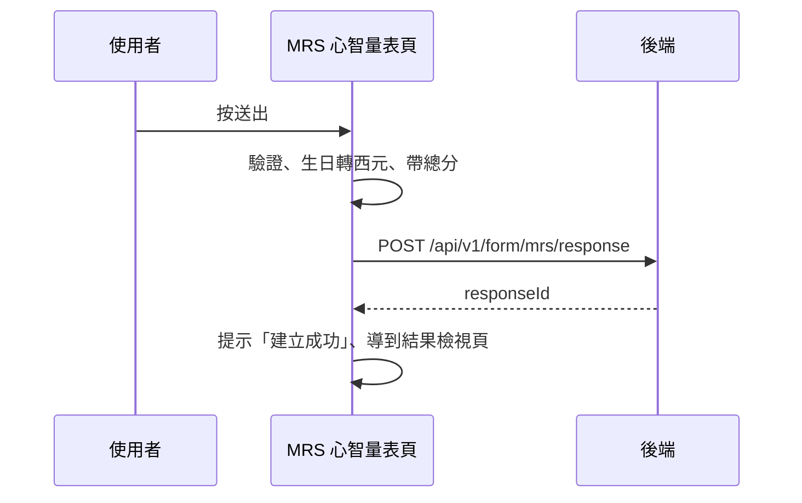

## 送出 MRS 心智量表

**觸發**：MRS 心智量表填寫頁按「送出」
`src/components/Form/CustomForm/MrsMental/IndexView.vue:795`

MRS 量表**不走通用的填答 API**，有自己專屬的端點；也沒有編輯模式，只有建立。

### 步驟

1. **表單驗證、組出填答資料** `src/components/Form/CustomForm/MrsMental/IndexView.vue:458-470`
   `handleSubmit` 驗證通過後，把表單內容加上 `formGid`、民國生日轉西元、
   前端算好的總分 → `POST /api/v1/form/mrs/response`（**寫入**） `src/api/form.ts:436`。
   期間掛上載入狀態。

2. **成功後提示並導到結果檢視頁** `src/components/Form/CustomForm/MrsMental/IndexView.vue:473-474`
   顯示「建立成功」，`router.replace` 到 FormResponseDetail（帶回 `responseId`）。

### 序列圖

### 資料變化

| 對象 | 動作 | 位置 |
|---|---|---|
| `POST /api/v1/form/mrs/response` | **寫入**，建立 MRS 填答 | `src/api/form.ts:436` |
| 導頁 | 成功後轉到 FormResponseDetail | `src/components/Form/CustomForm/MrsMental/IndexView.vue:474` |
| 提示 Store | 成功訊息 | `src/components/Form/CustomForm/MrsMental/IndexView.vue:473` |
| 載入 Store | 掛上與解除 | `src/components/Form/CustomForm/MrsMental/IndexView.vue:462` |

### 異常與補償

- 失敗有 `catch`：顯示「表單已關閉」提示視窗
  `src/components/Form/CustomForm/MrsMental/IndexView.vue:485-488`，
  確認後回上一頁；載入狀態正常解除；全域攔截器的錯誤提示仍會出現（見全域前置）。

### 全域前置

授權標頭注入與錯誤顯示見〈每個請求送出前〉與〈API 錯誤的全域處理〉。
