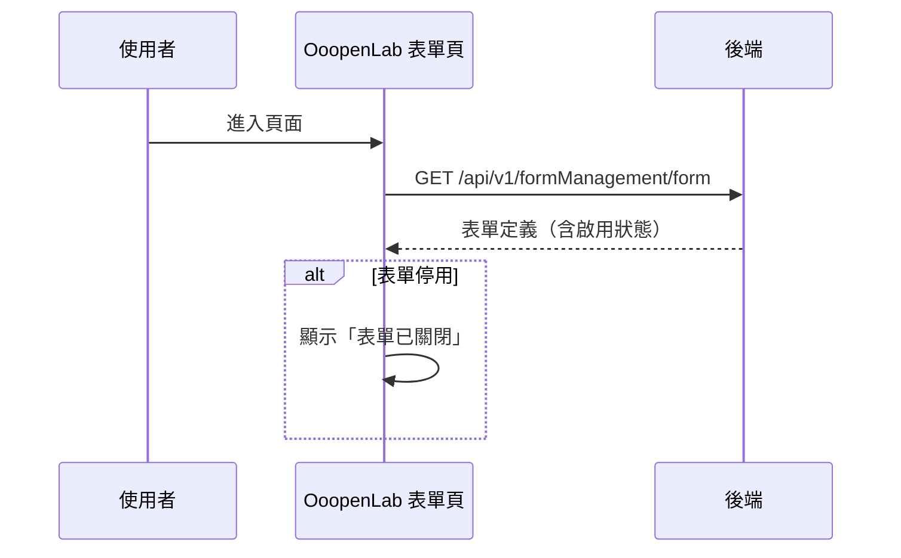

## 進入 OoopenLab 表單頁（載入表單定義）

**觸發**：OoopenLab 表單頁載入
`src/components/Form/CustomForm/OoopenLab/OoopenLabView.vue:25`

### 步驟

1. **取得表單定義** `src/components/Form/CustomForm/OoopenLab/OoopenLabView.vue:47-58`
   沒有 `formGid` 直接略過。
   → `GET /api/v1/formManagement/form`（讀取） `src/api/form.ts:84`，
   取回機構、標題、描述、啟用狀態與 formJson。

2. **停用的表單直接標記關閉** `src/components/Form/CustomForm/OoopenLab/OoopenLabView.vue:26-27`
   `enable` 為否就把頁面切到「表單已關閉」狀態。

### 序列圖

### 資料變化

| 對象 | 動作 | 位置 |
|---|---|---|
| `GET /api/v1/formManagement/form` | 唯讀 | `src/api/form.ts:84` |
| 版面 Store | 查詢失敗時切到「找不到頁面」 | `src/components/Form/CustomForm/OoopenLab/OoopenLabView.vue:59` |

### 異常與補償

- 查詢失敗有 `catch`：切換到**找不到頁面**版面
  `src/stores/layout.ts:29-34`，不是只彈錯誤訊息——
  拿不到表單定義這頁就無法運作，直接整頁替換。

### 全域前置

授權標頭注入與錯誤顯示見〈每個請求送出前〉與〈API 錯誤的全域處理〉。
