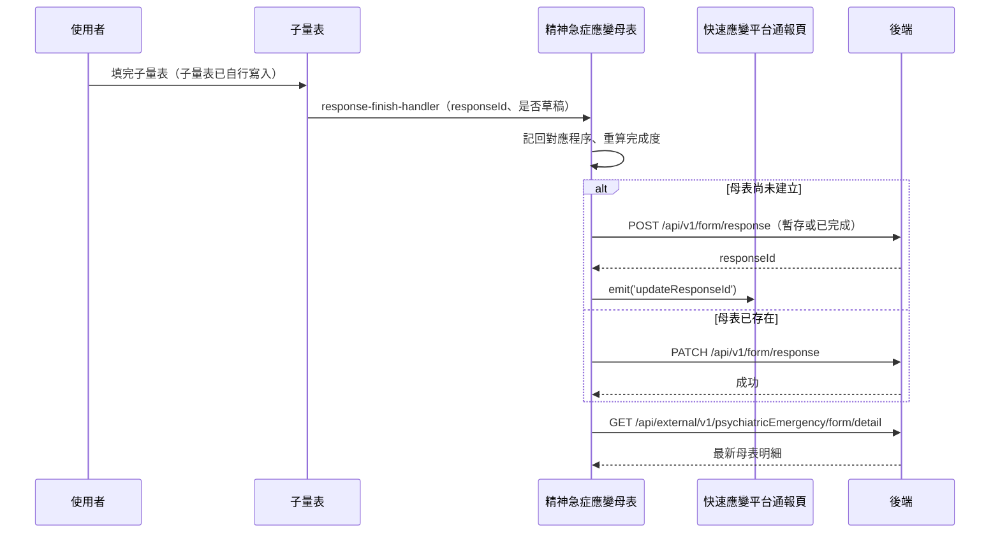

---
covers:
  - src/components/Form/CustomForm/PsychiatricEmergencyResponseSystem/components/Response/IndexView.vue:935:CustomForm:response-finish-handler
---

## 子量表填完後回寫精神急症應變表

**觸發**：精神急症應變系統填答頁內嵌的子量表填寫完成（兩種子量表元件走同一條路徑）：

| 控件 | 位置 |
|---|---|
| 彈性表單子量表完成 | `src/components/Form/CustomForm/PsychiatricEmergencyResponseSystem/components/Response/IndexView.vue:920` |
| 客製表單子量表完成 | `src/components/Form/CustomForm/PsychiatricEmergencyResponseSystem/components/Response/IndexView.vue:935` |

精神急症應變表是一張**母表**：通報、處置、流程設定、再通報、訪視進度五個程序各掛
一串子量表。子量表自己寫入完成後，把 `responseId` 回拋給母表，母表**跟著更新自己**。

### 步驟

1. **把子量表的結果記回母表對應程序** `src/components/Form/CustomForm/PsychiatricEmergencyResponseSystem/components/Response/IndexView.vue:196-215`
   依程序類型找到對應清單，把該子量表的 `responseId`、是否草稿、
   更新人與時間寫進母表資料。

2. **母表重算完成度並寫入** `src/components/Form/CustomForm/PsychiatricEmergencyResponseSystem/components/Response/IndexView.vue:245-316`
   該程序的完成狀態＝「所有必填子量表都有填答且非草稿」
   （訪視進度例外，由專屬按鈕手動設定）。然後依狀態：
   - **母表還沒建立過** → `POST /api/v1/form/response`（**寫入**）
     `src/components/Form/CustomForm/PsychiatricEmergencyResponseSystem/components/Response/IndexView.vue:321`，
     狀態依完成度送「暫存」或「已完成」；成功後記下 `responseId`，
     `emit('updateResponseId')` 通知快速應變平台通報頁
     `src/views/RapidResponsePlatform/Reporting/IndexView.vue:350`，
     並再往上發 `response-finish-handler`。
   - **母表已存在** → `PATCH /api/v1/form/response`（**寫入**）
     `src/components/Form/CustomForm/PsychiatricEmergencyResponseSystem/components/Response/IndexView.vue:351`，
     成功後往上發 `response-finish-handler`。

3. **重抓母表明細** `src/components/Form/CustomForm/PsychiatricEmergencyResponseSystem/components/Response/IndexView.vue:105-119`
   → `GET /api/external/v1/psychiatricEmergency/form/detail`（讀取，try 保護內，
   失敗只記 console 不中斷），刷新畫面上的填答狀況。

4. **關閉或保留子量表視窗** `src/components/Form/CustomForm/PsychiatricEmergencyResponseSystem/components/Response/IndexView.vue:229-230`
   若剛填完的是巢狀的精神急症應變表本身，保留視窗讓使用者續填其他子量表；
   否則關閉子量表區塊。

### 序列圖

### 資料變化

| 對象 | 動作 | 位置 |
|---|---|---|
| `POST /api/v1/form/response` | **寫入**，建立母表填答 | `src/components/Form/CustomForm/PsychiatricEmergencyResponseSystem/components/Response/IndexView.vue:321` |
| `PATCH /api/v1/form/response` | **寫入**，更新母表填答 | `src/components/Form/CustomForm/PsychiatricEmergencyResponseSystem/components/Response/IndexView.vue:351` |
| `GET /api/external/v1/psychiatricEmergency/form/detail` | 唯讀，寫入後重抓明細 | `src/components/Form/CustomForm/PsychiatricEmergencyResponseSystem/components/Response/IndexView.vue:109` |
| 載入 Store | 各段掛上與解除（`finally`） | `src/components/Form/CustomForm/PsychiatricEmergencyResponseSystem/components/Response/IndexView.vue:320` |

### 異常與補償

- 建立與更新都有 `catch`：失敗時顯示「表單已關閉」視窗
  `src/components/Form/CustomForm/PsychiatricEmergencyResponseSystem/components/Response/IndexView.vue:371-374`，
  確認後關閉子量表區塊（不導頁）。載入狀態在 `finally` 解除。
- 明細重抓自帶 try／catch，失敗只記 console、不擋流程——
  此時母表已寫入成功，只是畫面明細可能舊。

### 未追蹤的部分

- 往上發的 `response-finish-handler` 由
  `src/components/Form/CustomForm/PsychiatricEmergencyResponseSystem/IndexView.vue:473`
  原樣轉發，**再上一層的 handler 解析不到**，後續未追蹤。
- 同頁 `src/components/Form/CustomForm/PsychiatricEmergencyResponseSystem/components/Response/IndexView.vue:896`
  的按鈕（總覽列為同組 API 的寫入流程）**封包未保存**（檔名截斷互撞），未成章節。

### 全域前置

授權標頭注入與錯誤顯示見〈每個請求送出前〉與〈API 錯誤的全域處理〉。
