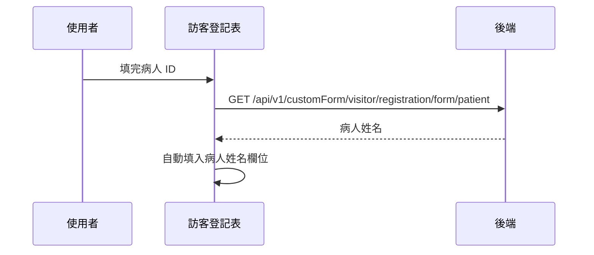

## 帶入住院病人資料（訪客登記）

**觸發**：訪客登記表的「病歷號／病人 ID」欄位輸入完成（change）
`src/components/Form/CustomForm/VisitorRegistrationForHospitalPatients/IndexView.vue:575`

填完病人 ID 就自動帶出病人姓名，減少手打錯誤。

### 步驟

1. **帶病人 ID 查詢** `src/components/Form/CustomForm/VisitorRegistrationForHospitalPatients/IndexView.vue:397-403`
   欄位是空的直接略過。
   → `GET /api/v1/customForm/visitor/registration/form/patient`（讀取） `src/api/form.ts:610`，
   查到姓名就自動填進「病人姓名」欄位。期間掛上載入狀態，`finally` 解除。

### 序列圖

### 資料變化

| 對象 | 動作 | 位置 |
|---|---|---|
| `GET /api/v1/customForm/visitor/registration/form/patient` | 唯讀 | `src/api/form.ts:610` |
| 載入 Store | 掛上與解除（`finally`） | `src/components/Form/CustomForm/VisitorRegistrationForHospitalPatients/IndexView.vue:399` |

### 異常與補償

- 查詢沒有 catch，失敗由全域 API 回應攔截器顯示錯誤（見全域前置）；
  欄位不會被填入，使用者可手動輸入。載入狀態在 `finally` 解除。

### 全域前置

授權標頭注入與錯誤顯示見〈每個請求送出前〉與〈API 錯誤的全域處理〉。
