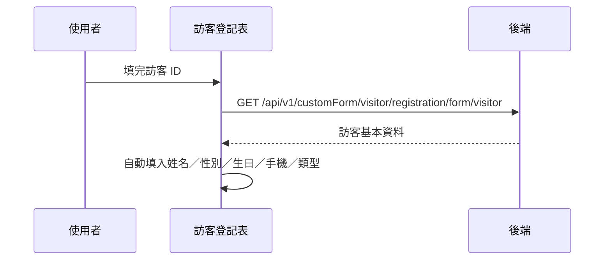

## 帶入訪客資料（訪客登記）

**觸發**：訪客登記表的「訪客 ID」欄位輸入完成（change）
`src/components/Form/CustomForm/VisitorRegistrationForHospitalPatients/IndexView.vue:622`

與〈帶入住院病人資料〉同一個模式，帶回的欄位更多。

### 步驟

1. **帶訪客 ID 查詢** `src/components/Form/CustomForm/VisitorRegistrationForHospitalPatients/IndexView.vue:408-421`
   欄位是空的直接略過。
   → `GET /api/v1/customForm/visitor/registration/form/visitor`（讀取） `src/api/form.ts:617`，
   查到就自動填入訪客姓名、性別、生日、手機與訪客類型。
   期間掛上載入狀態，`finally` 解除。

### 序列圖

### 資料變化

| 對象 | 動作 | 位置 |
|---|---|---|
| `GET /api/v1/customForm/visitor/registration/form/visitor` | 唯讀 | `src/api/form.ts:617` |
| 載入 Store | 掛上與解除（`finally`） | `src/components/Form/CustomForm/VisitorRegistrationForHospitalPatients/IndexView.vue:410` |

### 異常與補償

- 查詢沒有 catch，失敗由全域 API 回應攔截器顯示錯誤（見全域前置）；
  欄位不會被填入，使用者可手動輸入。載入狀態在 `finally` 解除。

### 全域前置

授權標頭注入與錯誤顯示見〈每個請求送出前〉與〈API 錯誤的全域處理〉。
