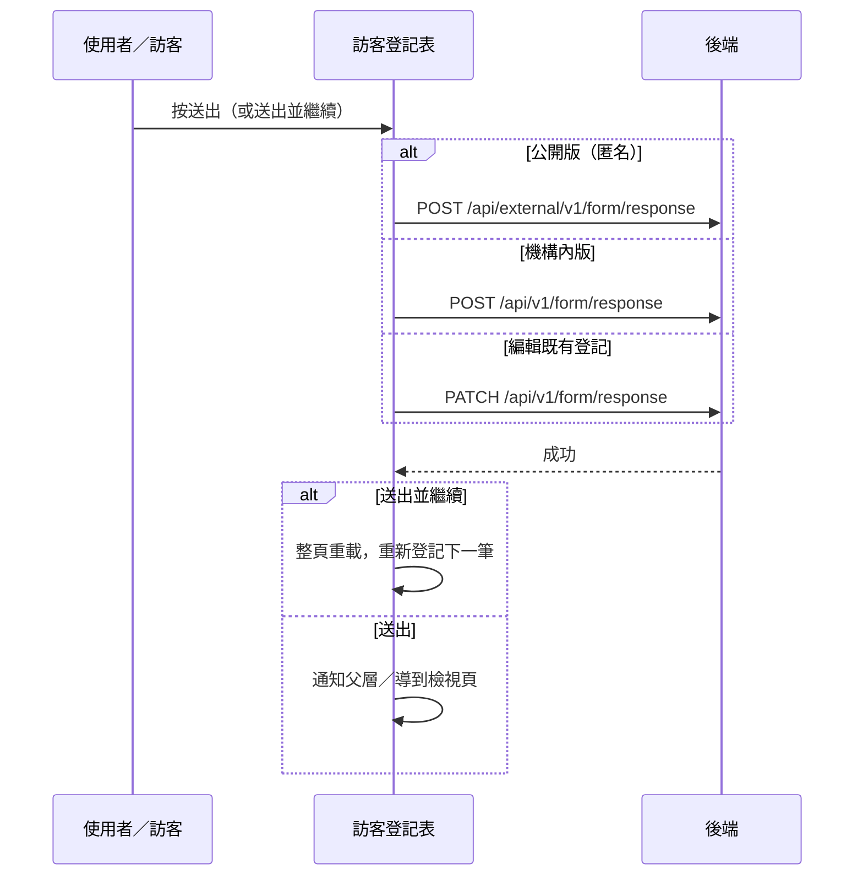

---
covers:
  - src/components/Form/CustomForm/VisitorRegistrationForHospitalPatients/IndexView.vue:795:UtilButton:click
---

## 送出住院病人訪客登記

**觸發**：訪客登記表的兩顆送出鈕，走同一條路徑，差別只在送出後**要不要連續登記下一筆**：

| 控件 | 位置 |
|---|---|
| 送出 | `src/components/Form/CustomForm/VisitorRegistrationForHospitalPatients/IndexView.vue:794` |
| 送出並繼續登記 | `src/components/Form/CustomForm/VisitorRegistrationForHospitalPatients/IndexView.vue:795` |

這張表有**匿名公開版**（訪客自行掃碼填寫，不登入）與**機構內版**，寫入走不同 API。

### 步驟

1. **驗證與時間欄位正規化** `src/components/Form/CustomForm/VisitorRegistrationForHospitalPatients/IndexView.vue:267-277`
   缺機構 ID、或機構內版未登入，直接中止。訪客生日、探訪起訖時間轉成 UTC ISO 字串。

2. **依版本與模式送出（狀態一律「已完成」）** `src/components/Form/CustomForm/VisitorRegistrationForHospitalPatients/IndexView.vue:278-285`
   - **公開版首次填寫** → `POST /api/external/v1/form/response`（**寫入**，對外匿名端點）
     `src/api/publicForm.ts:12`。成功後提示「建立成功」；
     「送出並繼續」→ `location.reload()` 整頁重載重新登記；
     「送出」→ `emit('successful')` 往上通知（父層再轉發，後續未追蹤）。
   - **機構內版首次填寫** → `POST /api/v1/form/response`（**寫入**） `src/api/form.ts:318`。
     成功後提示「建立成功」；「送出並繼續」→ 整頁重載；
     「送出」→ `router.replace` 到檢視頁（FormResponseDetail）。
   - **編輯既有登記** → `PATCH /api/v1/form/response`（**寫入**） `src/api/form.ts:349`，
     成功後提示「編輯成功」。

   期間掛上載入狀態（各 handler 以 `finally` 解除）。

### 序列圖

### 資料變化

| 對象 | 動作 | 位置 |
|---|---|---|
| `POST /api/external/v1/form/response` | **寫入**，公開版建立登記 | `src/api/publicForm.ts:12` |
| `POST /api/v1/form/response` | **寫入**，機構內版建立登記 | `src/api/form.ts:318` |
| `PATCH /api/v1/form/response` | **寫入**，更新登記 | `src/api/form.ts:349` |
| 導頁 | 機構內版成功後轉到 FormResponseDetail | `src/components/Form/CustomForm/VisitorRegistrationForHospitalPatients/IndexView.vue:313` |
| 提示 Store | 建立／編輯成功訊息 | `src/components/Form/CustomForm/VisitorRegistrationForHospitalPatients/IndexView.vue:353` |
| 載入 Store | 掛上與解除（`finally`） | `src/components/Form/CustomForm/VisitorRegistrationForHospitalPatients/IndexView.vue:271` |

### 異常與補償

- 三條寫入路徑都有 `catch`：失敗時顯示「表單已關閉」提示視窗
  `src/components/Form/CustomForm/VisitorRegistrationForHospitalPatients/IndexView.vue:362-365`，
  確認後回上一頁；載入狀態在 `finally` 解除；
  全域攔截器的錯誤提示仍會出現（見全域前置）。

### 未追蹤的部分

- 公開版成功後的 `successful` 事件由
  `src/views/VistorRegistrationForHospitalPatients/components/CreateFormView.vue:79`
  原樣往上轉發，**再上一層的 handler 解析不到**——成功畫面如何呈現未追蹤。

### 全域前置

授權標頭注入與錯誤顯示見〈每個請求送出前〉與〈API 錯誤的全域處理〉。
