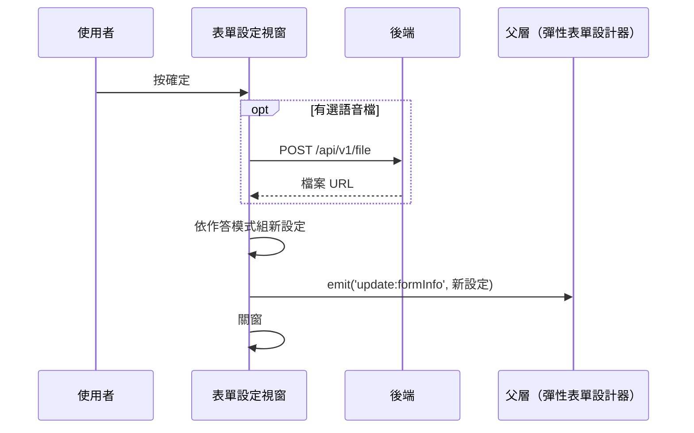

## 套用彈性表單設定（含歡迎語音上傳）

**觸發**：彈性表單設計器的「表單設定」視窗按確定
`src/components/Form/ElasticForm/components/ElaFormSettingsModal.vue:262`

這個視窗調整的是作答模式（單頁／多頁／LINE 作答／AI 導答）與公開、匿名、
僅邀請等旗標。**唯一會打後端的是上傳自訂歡迎語音檔**；設定本身不直接寫後端，
而是組好資料後回拋給父層。

### 步驟

1. **上傳自訂語音檔（有選檔才做）** `src/components/Form/ElasticForm/components/ElaFormSettingsModal.vue:131-156`
   兩道前端檢查：檔案超過大小上限、或取不到使用者的機構 ID，都顯示錯誤提示並放棄上傳
   （流程仍繼續）。通過就帶機構 ID 與檔案
   → `POST /api/v1/file`（**寫入**） `src/api/file.ts:10`，
   成功取回檔案 URL 併進設定。期間以視窗自己的載入鍵掛上載入狀態，`finally` 解除。

2. **依作答模式組出新的表單設定** `src/components/Form/ElasticForm/components/ElaFormSettingsModal.vue:177-222`
   純前端：多頁模式寫進 `isSingleBlock`，LINE 作答開 `isLineEnable`，
   AI 導答開 `isAiAssistantEnabled` 並帶歡迎詞與語音欄位；測驗、計分、顯示分數
   等旗標一併寫進 formJson。

3. **把新設定回拋給父層、關窗** `src/components/Form/ElasticForm/components/ElaFormSettingsModal.vue:205`
   `emit('update:formInfo', …)`。設定要等父層儲存表單時才會送到後端。

### 序列圖

### 資料變化

| 對象 | 動作 | 位置 |
|---|---|---|
| `POST /api/v1/file` | **寫入**，上傳歡迎語音檔 | `src/api/file.ts:10` |
| 提示 Store | 檔案過大／機構不明的錯誤提示 | `src/components/Form/ElasticForm/components/ElaFormSettingsModal.vue:135` |
| 載入 Store | 掛上與解除（`finally`，成功失敗都解除） | `src/components/Form/ElasticForm/components/ElaFormSettingsModal.vue:145` |

### 異常與補償

- **上傳失敗不會擋住流程**：`catch` 把結果化為 `null`
  `src/components/Form/ElasticForm/components/ElaFormSettingsModal.vue:154`，
  設定照樣回拋父層、照樣關窗，只是語音檔欄位維持原值；
  錯誤訊息仍由全域 API 回應攔截器顯示。
- 前端檢查（檔案過大、無機構 ID）同樣只放棄上傳、不中斷設定套用。

### 未追蹤的部分

- `emit('update:formInfo')` 的父層 listener 封包未解析到，
  新設定回到父層後如何併入表單、何時送出後端，見〈儲存表單設計〉。

### 全域前置

授權標頭注入與錯誤顯示見〈每個請求送出前〉與〈API 錯誤的全域處理〉。
