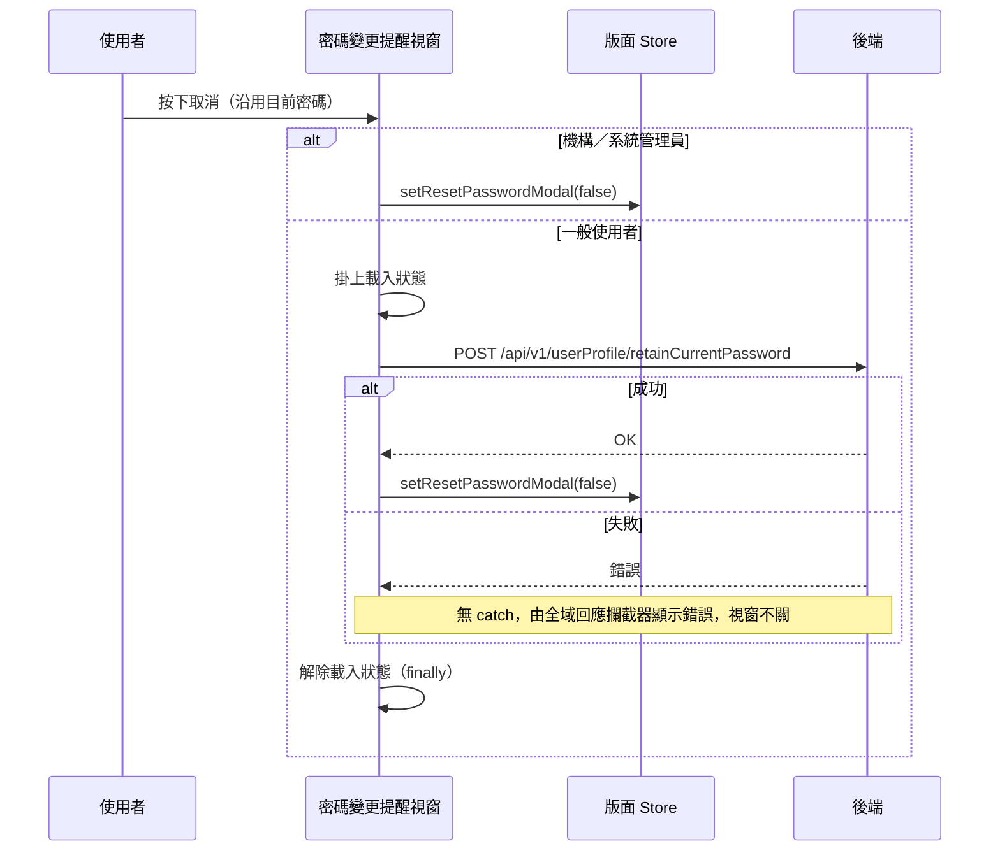

## 密碼變更提醒：沿用目前密碼

**觸發**：密碼變更提醒視窗按下取消（沿用目前密碼）
`src/layouts/Login/ResetPasswordModal.vue:144`

這個視窗放在登入版面層，顯示與否由版面 Store 的 `isShowResetPasswordModal` 控制
`src/stores/layout.ts:66-68`。

### 步驟

1. **管理員身分直接關閉視窗** `src/layouts/Login/ResetPasswordModal.vue:125-133`
   若目前身分是機構或系統管理員（`isOrgOrSystemAdmin`），不打任何 API，直接跳到第 3 步。
   也就是說「沿用密碼」這個決定只對一般使用者需要告知後端。

2. **告知後端沿用目前密碼** `src/layouts/Login/ResetPasswordModal.vue:129`
   掛上載入狀態後呼叫 `POST /api/v1/userProfile/retainCurrentPassword`（**寫入**）——
   使用者確認不需變更密碼，下次登入不再提示。

3. **成功才關閉視窗** `src/layouts/Login/ResetPasswordModal.vue:122`
   `closeModal` 寫在 `.then()` 裡，透過版面 Store 把 `isShowResetPasswordModal` 設為 false
   `src/stores/layout.ts:66-68`。

4. **無論成敗都解除載入狀態** `src/layouts/Login/ResetPasswordModal.vue:132`
   寫在 `.finally()` 裡。

### 序列圖

### 資料變化

| 對象 | 動作 | 位置 |
|---|---|---|
| `POST /api/v1/userProfile/retainCurrentPassword` | **記錄沿用目前密碼的決定**（下次登入不再提示） | `src/layouts/Login/ResetPasswordModal.vue:129` |
| 版面 Store | 關閉提醒視窗（`isShowResetPasswordModal = false`） | `src/layouts/Login/ResetPasswordModal.vue:122` |
| 載入 Store | 掛上後於 finally 解除 | `src/layouts/Login/ResetPasswordModal.vue:128`、`:132` |

### 異常與補償

- **API 沒有 try／catch**，失敗由全域回應攔截器統一顯示錯誤（見〈API 錯誤的全域處理〉）。
- **失敗時視窗不會關**——`closeModal` 只在成功路徑上，使用者可以直接重試。
- **載入狀態一定會解除** `src/layouts/Login/ResetPasswordModal.vue:132`，在 `.finally()` 裡。

### 全域前置

API 呼叫會經過〈每個請求送出前〉注入授權與語言標頭，失敗時由〈API 錯誤的全域處理〉接手。
