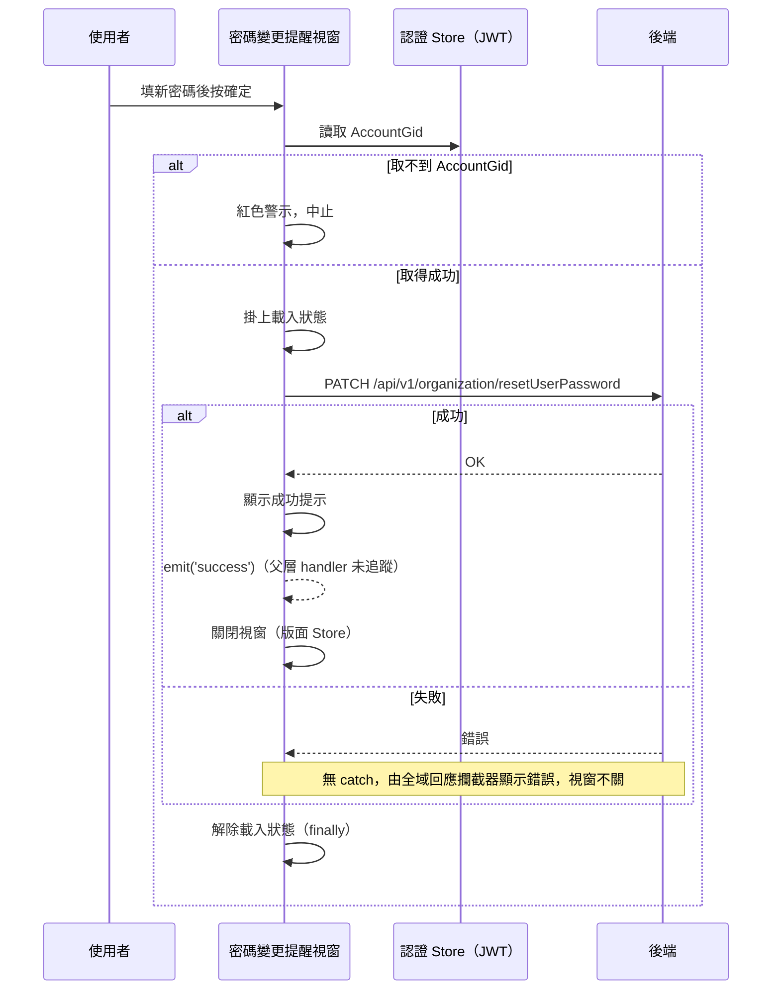

## 密碼變更提醒：設定新密碼

**觸發**：密碼變更提醒視窗填好新密碼後按下確定
`src/layouts/Login/ResetPasswordModal.vue:145`

這個視窗放在登入版面層，顯示與否由版面 Store 的 `isShowResetPasswordModal` 控制
`src/stores/layout.ts:66-68`。

### 步驟

1. **前置檢查：從 JWT 取出帳號識別碼** `src/layouts/Login/ResetPasswordModal.vue:103`
   `accountGid` 來自認證 Store 已解出的 JWT。取不到就顯示紅色警示
   （「AccountGid 為必填」）並中止，不會打 API。

2. **送出重設密碼請求** `src/layouts/Login/ResetPasswordModal.vue:110`
   掛上載入狀態後呼叫 `PATCH /api/v1/organization/resetUserPassword`（**寫入**），
   帶 `accountGid` 與表單上的新密碼。表單經 `handleSubmit` 驗證通過才會進到這裡
   `src/layouts/Login/ResetPasswordModal.vue:100-119`。

3. **成功後收尾** `src/layouts/Login/ResetPasswordModal.vue:114`
   依序：顯示「變更成功」綠色提示、發出 `success` 事件
   `src/layouts/Login/ResetPasswordModal.vue:115`、透過版面 Store 關閉視窗
   `src/layouts/Login/ResetPasswordModal.vue:122`。

4. **無論成敗都解除載入狀態** `src/layouts/Login/ResetPasswordModal.vue:118`
   寫在 `.finally()` 裡。

### 序列圖

### 資料變化

| 對象 | 動作 | 位置 |
|---|---|---|
| `PATCH /api/v1/organization/resetUserPassword` | **重設使用者密碼** | `src/layouts/Login/ResetPasswordModal.vue:110` |
| 提示 Store | 新增警示／成功提示（逾時自動移除 `src/stores/alert.ts:33`） | `src/layouts/Login/ResetPasswordModal.vue:103`、`:114` |
| 版面 Store | 關閉提醒視窗 | `src/layouts/Login/ResetPasswordModal.vue:122` |
| 載入 Store | 掛上後於 finally 解除 | `src/layouts/Login/ResetPasswordModal.vue:108`、`:118` |

### 異常與補償

- **API 沒有 try／catch**，失敗由全域回應攔截器統一顯示錯誤（見〈API 錯誤的全域處理〉）。
- **失敗時不發 `success`、不關視窗**，使用者可以直接重試。
- **載入狀態一定會解除** `src/layouts/Login/ResetPasswordModal.vue:118`，在 `.finally()` 裡。
- 前置檢查失敗（JWT 沒有 AccountGid）完全不打 API，只顯示警示。

### 未追蹤的部分

- `emit('success')` `src/layouts/Login/ResetPasswordModal.vue:115` 的父層 handler
  封包沒有提供跨元件連結，接收方未追蹤。

### 全域前置

API 呼叫會經過〈每個請求送出前〉注入授權與語言標頭，失敗時由〈API 錯誤的全域處理〉接手。
