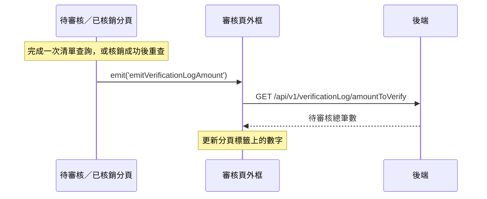

## 更新待審核筆數

**觸發**：待審核或已核銷分頁完成查詢後，往上發出 `emitVerificationLogAmount`，
由審核頁外框接住 `src/views/Appointment/AppointmentApproveList/IndexView.vue:81`

這條流程沒有對應的使用者動作——它是**其他流程的下游**。任何一次清單查詢
（〈查詢待審核預約清單〉、〈查詢已核銷預約清單〉）或核銷成功（〈核銷預約〉）
都會觸發它。

**這也是這一域唯一綁在動態元件上的事件**：`<component :is="currentTab.component">`。
因為分頁元件是執行期決定的，靜態分析無法從子元件反查到這個 listener——它是靠
父層這一側被掃到的。

### 步驟

1. **外框收到事件後呼叫自己的查詢** `src/views/Appointment/AppointmentApproveList/IndexView.vue:64-66`
   → `getVerificationLogAmountToVerify` `src/views/Appointment/AppointmentApproveList/IndexView.vue:54-62`

2. **掛上載入狀態** `src/views/Appointment/AppointmentApproveList/IndexView.vue:56`

3. **取得待審核筆數** `src/api/appointment/appointmentList.ts:62`
   `GET /api/v1/verificationLog/amountToVerify`

   注意這是**獨立的一支端點**，不是從清單查詢的結果推算出來的。所以筆數反映的是
   「全部待審核」而非「當前篩選條件下的待審核」——即使使用者正在用條件篩選，
   標籤上的數字仍是總數。

4. **解除載入狀態** `src/views/Appointment/AppointmentApproveList/IndexView.vue:61`

### 序列圖

### 資料變化

| 對象 | 動作 | 位置 |
|---|---|---|
| `GET /api/v1/verificationLog/amountToVerify` | 唯讀，取得待審核總筆數 | `src/api/appointment/appointmentList.ts:62` |
| 載入 Store | 掛上後解除 | `src/views/Appointment/AppointmentApproveList/IndexView.vue:61` |

### 異常與補償

沒有 try／catch。失敗由全域 API 回應攔截器處理，分頁標籤上維持前一次的數字。

### 全域前置

授權標頭注入與錯誤顯示見〈每個請求送出前〉與〈API 錯誤的全域處理〉。
