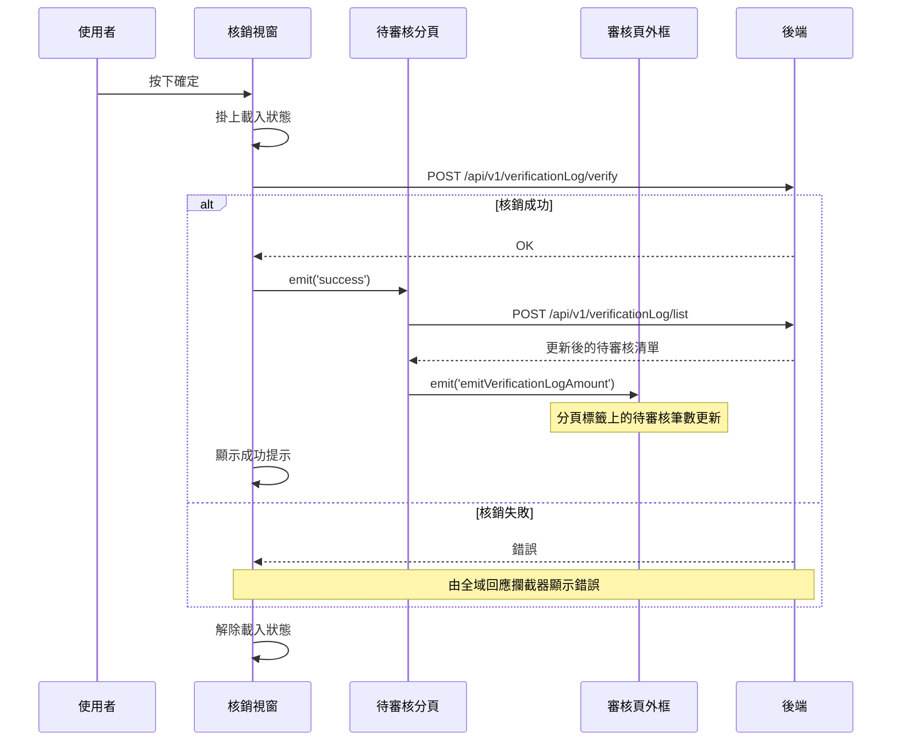

## 核銷預約（審核通過）

**觸發**：待審核清單點選某筆預約，於核銷視窗按下確定
`src/views/Appointment/AppointmentApproveList/components/AppointmentApproveModal.vue:194`

這是整個 Appointment 域**唯一會改變審核狀態**的動作，也是這一域三條寫入流程中唯一
會連帶更新其他畫面元素（待審核筆數）的一條。

### 步驟

1. **確定鈕轉呼叫實際的核銷函式** `src/views/Appointment/AppointmentApproveList/components/AppointmentApproveModal.vue:163-170`
   → `verifyAppointmentVerification` `src/views/Appointment/AppointmentApproveList/components/AppointmentApproveModal.vue:172-181`

2. **掛上載入狀態** `src/views/Appointment/AppointmentApproveList/components/AppointmentApproveModal.vue:173`

3. **送出核銷** `src/api/appointment/appointmentList.ts:78`
   `POST /api/v1/verificationLog/verify`。

4. **通知父層重新查詢待審核清單** `src/views/Appointment/AppointmentApproveList/components/AppointmentApproveModal.vue:176`
   發出 `success`，由待審核分頁接住
   `src/views/Appointment/AppointmentApproveList/components/AwaitingApproval/IndexView.vue:353`
   → `getAppointmentVerificationList` `src/views/Appointment/AppointmentApproveList/components/AwaitingApproval/IndexView.vue:145-155`
   → `POST /api/v1/verificationLog/list` `src/api/appointment/appointmentList.ts:56`

5. **重查時會再往上發一次事件更新待審核筆數**
   `src/views/Appointment/AppointmentApproveList/components/AwaitingApproval/IndexView.vue:152`
   這是**兩層 emit 串接**：核銷視窗 → 待審核分頁 → 審核頁外框。分頁標籤上的待審核
   筆數因此會跟著減少。不追這兩跳的話，會誤以為筆數不會更新。

6. **顯示成功提示** `src/views/Appointment/AppointmentApproveList/components/AppointmentApproveModal.vue:178`
   並解除載入狀態 `src/views/Appointment/AppointmentApproveList/components/AppointmentApproveModal.vue:180`

### 序列圖

### 資料變化

| 對象 | 動作 | 位置 |
|---|---|---|
| `POST /api/v1/verificationLog/verify` | **核銷該筆預約**，改變審核狀態 | `src/api/appointment/appointmentList.ts:78` |
| `POST /api/v1/verificationLog/list` | 唯讀，核銷後重查待審核清單 | `src/api/appointment/appointmentList.ts:56` |
| 提示 Store | 新增成功提示 | `src/views/Appointment/AppointmentApproveList/components/AppointmentApproveModal.vue:178` |
| 載入 Store | 掛上後解除 | `src/views/Appointment/AppointmentApproveList/components/AppointmentApproveModal.vue:180` |

`POST /api/v1/verificationLog/list` 雖然是 POST，**是查詢而非寫入**——複雜的篩選條件
放在 request body 裡。

### 異常與補償

- 核銷 API **沒有 try／catch**，失敗由全域 API 回應攔截器顯示錯誤。
- 失敗時不發 `success`，因此清單與待審核筆數都不會變動，畫面與後端狀態保持一致。
- 沒有部分成功的可能：核銷是單一次寫入，後續兩次查詢即使失敗也只影響畫面新鮮度，
  不影響已完成的核銷。

### 全域前置

授權標頭注入與錯誤顯示見〈每個請求送出前〉與〈API 錯誤的全域處理〉。
