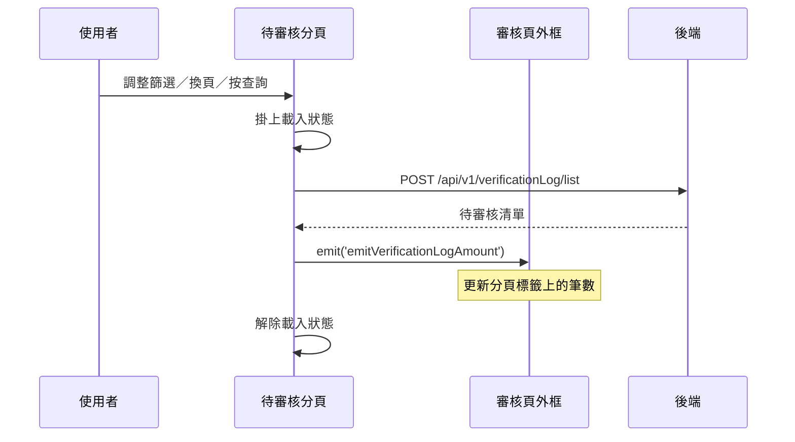

---
covers:
  - src/views/Appointment/AppointmentApproveList/components/AwaitingApproval/IndexView.vue:271:UtilFormSelect:change
  - src/views/Appointment/AppointmentApproveList/components/AwaitingApproval/IndexView.vue:280:UtilFormInput:clear
  - src/views/Appointment/AppointmentApproveList/components/AwaitingApproval/IndexView.vue:307:UtilTable:change-limit
  - src/views/Appointment/AppointmentApproveList/components/AwaitingApproval/IndexView.vue:308:UtilTable:change-page
---

## 查詢待審核預約清單

**觸發**：待審核分頁上**八個**控件都走這條路徑：

| 控件 | 位置 |
|---|---|
| 查詢鈕 | `src/views/Appointment/AppointmentApproveList/components/AwaitingApproval/IndexView.vue:284` |
| 狀態下拉 | `src/views/Appointment/AppointmentApproveList/components/AwaitingApproval/IndexView.vue:260` |
| 狀態下拉（第二組） | `src/views/Appointment/AppointmentApproveList/components/AwaitingApproval/IndexView.vue:271` |
| 關鍵字按 Enter | `src/views/Appointment/AppointmentApproveList/components/AwaitingApproval/IndexView.vue:281` |
| 關鍵字清空 | `src/views/Appointment/AppointmentApproveList/components/AwaitingApproval/IndexView.vue:280` |
| 日期選擇 | `src/views/Appointment/AppointmentApproveList/components/AwaitingApproval/IndexView.vue:297` |
| 變更每頁筆數 | `src/views/Appointment/AppointmentApproveList/components/AwaitingApproval/IndexView.vue:307` |
| 換頁 | `src/views/Appointment/AppointmentApproveList/components/AwaitingApproval/IndexView.vue:308` |

### 步驟

1. **掛上載入狀態** `src/views/Appointment/AppointmentApproveList/components/AwaitingApproval/IndexView.vue:146`

2. **查詢待審核清單** `src/api/appointment/appointmentList.ts:56`
   `POST /api/v1/verificationLog/list`。**這是查詢而非寫入**——用 POST 是因為篩選條件
   （狀態、關鍵字、日期區間、分頁）放在 request body 裡，query string 裝不下。

3. **往上通知待審核筆數** `src/views/Appointment/AppointmentApproveList/components/AwaitingApproval/IndexView.vue:152`
   發出 `emitVerificationLogAmount`，由審核頁外框接住並更新分頁標籤上的數字。
   **每一次查詢都會發**，不只在核銷之後——所以調整篩選條件時，標籤上的數字也會跟著
   反映當前條件下的筆數。

4. **解除載入狀態** `src/views/Appointment/AppointmentApproveList/components/AwaitingApproval/IndexView.vue:154`

### 序列圖

### 資料變化

| 對象 | 動作 | 位置 |
|---|---|---|
| `POST /api/v1/verificationLog/list` | 唯讀（POST 僅為傳遞篩選條件） | `src/api/appointment/appointmentList.ts:56` |
| 載入 Store | 掛上後解除 | `src/views/Appointment/AppointmentApproveList/components/AwaitingApproval/IndexView.vue:154` |

不改變任何後端資料。

### 異常與補償

沒有 try／catch。查詢失敗由全域 API 回應攔截器處理，清單維持前一次內容，
**且不會發出筆數事件**，所以分頁標籤上的數字不會被錯誤地更新。

### 全域前置

授權標頭注入與錯誤顯示見〈每個請求送出前〉與〈API 錯誤的全域處理〉。
