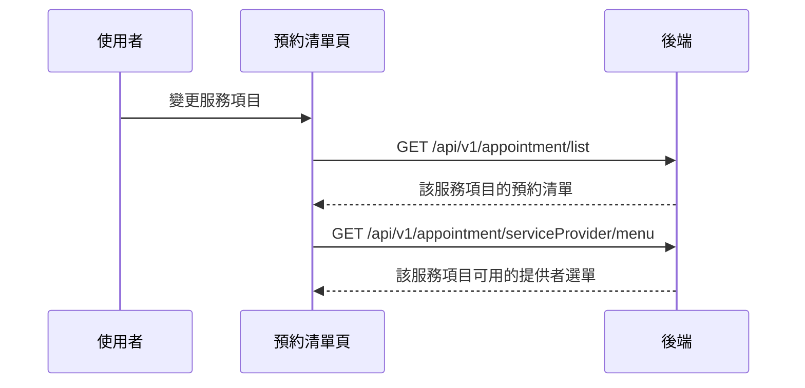

## 切換服務項目（連動服務提供者選單）

**觸發**：預約清單頁變更「服務項目」下拉
`src/views/Appointment/AppointmentList/IndexView.vue:462`

這是清單頁上**唯一一個會打兩支 API** 的篩選控件，所以與其他篩選條件分開記錄。

### 步驟

1. **重新查詢預約清單** `src/views/Appointment/AppointmentList/IndexView.vue:443-447`
   與其他篩選條件相同的路徑，見〈查詢預約清單〉
   → `GET /api/v1/appointment/list` `src/api/appointment/appointmentList.ts:10`

2. **連帶重新取得服務提供者選單** `src/views/Appointment/AppointmentList/IndexView.vue:197-202`
   → `GET /api/v1/appointment/serviceProvider/menu` `src/api/appointment/appointmentList.ts:38`

   這一步是這條流程存在的理由：**服務提供者是隨服務項目變動的**。換了服務項目，
   原本選單裡的提供者可能不再適用，所以必須重抓。若只重查清單而不更新選單，
   使用者可能選到一組不合法的組合。

### 序列圖

### 資料變化

| 對象 | 動作 | 位置 |
|---|---|---|
| `GET /api/v1/appointment/list` | 唯讀 | `src/api/appointment/appointmentList.ts:10` |
| `GET /api/v1/appointment/serviceProvider/menu` | 唯讀，取得連動選單 | `src/api/appointment/appointmentList.ts:38` |
| 網址 query | 寫入查詢條件 | `src/utils/composables/useQueryData.ts:145` |
| 載入 Store | 兩次查詢各自掛上與解除 | `src/views/Appointment/AppointmentList/IndexView.vue:238` |

### 異常與補償

兩支查詢都沒有 try／catch，失敗由全域 API 回應攔截器處理。

**值得注意的失敗模式**：兩次查詢是獨立的，若清單成功而選單失敗，畫面會呈現
「新的清單 + 舊的提供者選單」。程式碼沒有對這種部分失敗做補償。

### 全域前置

授權標頭注入與錯誤顯示見〈每個請求送出前〉與〈API 錯誤的全域處理〉。
