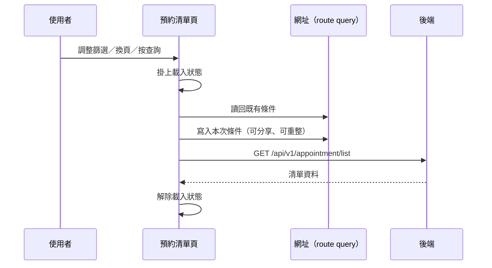

---
covers:
  - src/views/Appointment/AppointmentList/IndexView.vue:478:UtilFormSelect:change
  - src/views/Appointment/AppointmentList/IndexView.vue:495:UtilFormInput:clear
  - src/views/Appointment/AppointmentList/IndexView.vue:521:UtilTable:change-limit
  - src/views/Appointment/AppointmentList/IndexView.vue:522:UtilTable:change-page
---

## 查詢預約清單

**觸發**：預約清單頁上**九個**控件都走這條路徑，都是同一個查詢動作的不同入口：

| 控件 | 位置 |
|---|---|
| 查詢鈕 | `src/views/Appointment/AppointmentList/IndexView.vue:499` |
| 狀態下拉 | `src/views/Appointment/AppointmentList/IndexView.vue:470` |
| 狀態下拉（第二組） | `src/views/Appointment/AppointmentList/IndexView.vue:478` |
| 狀態下拉（第三組） | `src/views/Appointment/AppointmentList/IndexView.vue:486` |
| 關鍵字輸入按 Enter | `src/views/Appointment/AppointmentList/IndexView.vue:496` |
| 關鍵字清空 | `src/views/Appointment/AppointmentList/IndexView.vue:495` |
| 日期選擇 | `src/views/Appointment/AppointmentList/IndexView.vue:511` |
| 變更每頁筆數 | `src/views/Appointment/AppointmentList/IndexView.vue:521` |
| 換頁 | `src/views/Appointment/AppointmentList/IndexView.vue:522` |

### 步驟

1. **掛上載入狀態** `src/views/Appointment/AppointmentList/IndexView.vue:229`

2. **把畫面上的查詢條件同步到網址** `src/utils/composables/useQueryData.ts:106-146`
   這是這條流程最容易被忽略的一步。查詢條件不只存在元件狀態裡，還會寫回 URL query
   `src/utils/composables/useQueryData.ts:145`，所以：
   - 使用者可以把篩選結果的網址複製給同事
   - 重新整理不會遺失條件
   - 瀏覽器上一頁會回到前一組條件

   反向也成立——進頁時先從網址讀回條件
   `src/utils/composables/useQueryData.ts:102-104`，這就是為什麼帶參數的連結能直接
   開在正確的篩選狀態。

3. **帶著條件查詢清單** `src/api/appointment/appointmentList.ts:10`
   `GET /api/v1/appointment/list`。

4. **解除載入狀態** `src/views/Appointment/AppointmentList/IndexView.vue:238`

### 序列圖

### 資料變化

| 對象 | 動作 | 位置 |
|---|---|---|
| `GET /api/v1/appointment/list` | 唯讀 | `src/api/appointment/appointmentList.ts:10` |
| 網址 query | 寫入查詢條件（導航） | `src/utils/composables/useQueryData.ts:145` |
| 載入 Store | 掛上後解除 | `src/views/Appointment/AppointmentList/IndexView.vue:238` |

不改變任何後端資料。

### 異常與補償

沒有 try／catch。查詢失敗由全域 API 回應攔截器顯示錯誤（見〈API 錯誤的全域處理〉），
清單維持前一次的內容。載入狀態的解除在成功路徑上，失敗時**依賴攔截器最後的
「清空載入狀態」安全網**。

### 未追蹤的部分

- 網址導航的實際目標是執行期算出來的 `src/utils/composables/useQueryData.ts:145`，
  靜態分析無法決定最終網址。
- 查詢條件的序列化細節位於共用層 `src/utils/composables/useQueryData.ts:62-100`。
