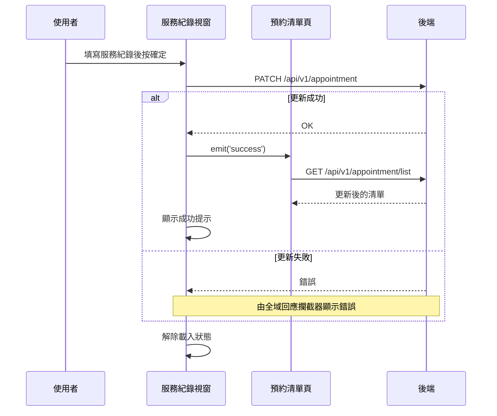

## 填寫預約服務紀錄

**觸發**：預約清單頁開啟某筆預約的服務紀錄視窗，按下確定
`src/views/Appointment/AppointmentList/components/AppointmentRecordModal.vue:192`

### 步驟

1. **送出更新** `src/api/appointment/appointmentList.ts:46`
   `PATCH /api/v1/appointment`。這支端點是**部分更新**——只送視窗裡填的服務紀錄欄位，
   不會覆寫預約的其他資料。

2. **通知父層清單重新查詢** `src/views/Appointment/AppointmentList/components/AppointmentRecordModal.vue:174`
   發出 `success` 事件，父層在 `src/views/Appointment/AppointmentList/IndexView.vue:595`
   接住並重查
   → `GET /api/v1/appointment/list` `src/api/appointment/appointmentList.ts:10`

3. **顯示成功提示** `src/views/Appointment/AppointmentList/components/AppointmentRecordModal.vue:176`

4. **解除載入狀態** `src/views/Appointment/AppointmentList/components/AppointmentRecordModal.vue:178`

**注意步驟順序**：這條流程是「先通知重查、再顯示提示」
`src/views/Appointment/AppointmentList/components/AppointmentRecordModal.vue:174`，
與〈取消預約〉的「先提示、再通知」相反。兩者結果相同，但若要追查「提示出現時清單是否
已更新」，順序有差。

### 序列圖

### 資料變化

| 對象 | 動作 | 位置 |
|---|---|---|
| `PATCH /api/v1/appointment` | **寫入服務紀錄**（部分更新） | `src/api/appointment/appointmentList.ts:46` |
| `GET /api/v1/appointment/list` | 唯讀，更新後重新取得清單 | `src/api/appointment/appointmentList.ts:10` |
| 提示 Store | 新增成功提示 | `src/views/Appointment/AppointmentList/components/AppointmentRecordModal.vue:176` |
| 載入 Store | 解除 | `src/views/Appointment/AppointmentList/components/AppointmentRecordModal.vue:178` |

### 異常與補償

- 更新 API **沒有 try／catch**，失敗由全域 API 回應攔截器顯示錯誤。
- 失敗時不發 `success`，清單不會重查，使用者可修正後重試。

### 全域前置

授權標頭注入與錯誤顯示見〈每個請求送出前〉與〈API 錯誤的全域處理〉。
