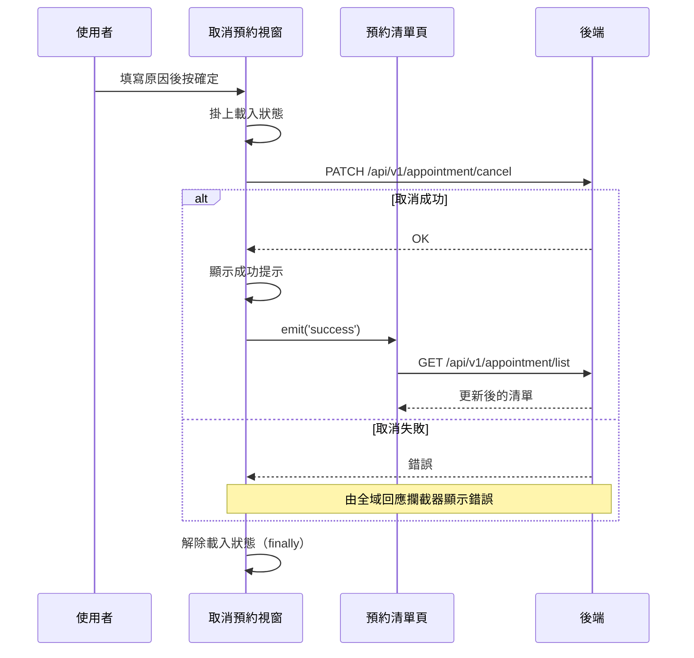

## 取消預約

**觸發**：預約清單頁點擊某筆預約的取消，於確認視窗按下確定
`src/views/Appointment/AppointmentList/components/CancelAppointmentModal.vue:78`

### 步驟

1. **掛上載入狀態** `src/views/Appointment/AppointmentList/components/CancelAppointmentModal.vue:55`

2. **送出取消請求** `src/api/appointment/appointmentList.ts:50`
   `PATCH /api/v1/appointment/cancel`，帶預約代碼與**取消原因**。原因是使用者在視窗裡
   填的必要輸入，不是系統自動產生。

3. **顯示成功提示** `src/views/Appointment/AppointmentList/components/CancelAppointmentModal.vue:62`

4. **通知父層清單重新查詢** `src/views/Appointment/AppointmentList/components/CancelAppointmentModal.vue:63`
   發出 `success` 事件。這一步是這條流程能不能「看起來正確」的關鍵——取消成功後
   清單必須反映新狀態，而視窗本身沒有清單資料，只能請父層重查。

5. **父層收到事件後重新取得預約清單** `src/views/Appointment/AppointmentList/IndexView.vue:600`
   → `getAppointmentList` `src/views/Appointment/AppointmentList/IndexView.vue:228-239`
   → `GET /api/v1/appointment/list` `src/api/appointment/appointmentList.ts:10`

6. **無論成功或失敗都解除載入狀態** `src/views/Appointment/AppointmentList/components/CancelAppointmentModal.vue:66`
   寫在 `finally` 裡。

### 序列圖

### 資料變化

| 對象 | 動作 | 位置 |
|---|---|---|
| `PATCH /api/v1/appointment/cancel` | **取消該筆預約**，寫入取消原因 | `src/api/appointment/appointmentList.ts:50` |
| `GET /api/v1/appointment/list` | 唯讀，取消後重新取得清單 | `src/api/appointment/appointmentList.ts:10` |
| 提示 Store | 新增成功提示 | `src/views/Appointment/AppointmentList/components/CancelAppointmentModal.vue:62` |
| 載入 Store | 掛上後於 finally 解除 | `src/views/Appointment/AppointmentList/components/CancelAppointmentModal.vue:66` |

### 異常與補償

- **取消 API 沒有 try／catch。** 失敗時錯誤會往上拋，由全域的 API 回應攔截器統一
  顯示紅色提示（見〈API 錯誤的全域處理〉）。這是刻意的分工，不是遺漏。
- **失敗時不會發出 `success` 事件**，所以清單不會被無謂地重查，畫面維持原狀，
  使用者可以直接重試。
- **載入狀態一定會解除** `src/views/Appointment/AppointmentList/components/CancelAppointmentModal.vue:66`
  ——它在 `.finally()` 裡，成功或失敗都會執行。
- 沒有回滾需求：取消是單一次寫入，沒有先寫本地狀態再同步的問題。

### 全域前置

這條流程的兩次 API 呼叫都會經過〈每個請求送出前〉注入授權與語言標頭，
失敗時由〈API 錯誤的全域處理〉接手。此處不重述。
