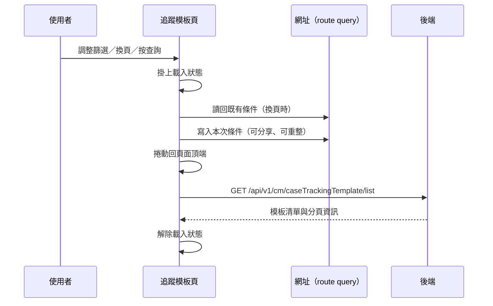

---
covers:
  - src/views/Case/TrackingTemplate/IndexView.vue:161:UtilFormInput:clear
  - src/views/Case/TrackingTemplate/IndexView.vue:184:UtilTable:change-limit
---

## 查詢追蹤模板清單

**觸發**：追蹤模板頁上**七個**控件都走這條路徑，都是同一個查詢動作的不同入口：

| 控件 | 位置 |
|---|---|
| 查詢鈕 | `src/views/Case/TrackingTemplate/IndexView.vue:165` |
| 搜尋下拉選擇 | `src/views/Case/TrackingTemplate/IndexView.vue:146` |
| 下拉選擇 | `src/views/Case/TrackingTemplate/IndexView.vue:153` |
| 關鍵字輸入按鍵 | `src/views/Case/TrackingTemplate/IndexView.vue:162` |
| 關鍵字清空 | `src/views/Case/TrackingTemplate/IndexView.vue:161` |
| 變更每頁筆數 | `src/views/Case/TrackingTemplate/IndexView.vue:184` |
| 換頁 | `src/views/Case/TrackingTemplate/IndexView.vue:185` |

### 步驟

1. **掛上載入狀態** `src/views/Case/TrackingTemplate/IndexView.vue:71`
   同時整理查詢條件：換頁時先從網址讀回既有條件
   `src/utils/composables/useQueryData.ts:102-104`，其餘入口把頁碼重設為 1；
   組織條件若還沒選，補上組織選項的第一筆當預設 `src/views/Case/TrackingTemplate/IndexView.vue:70-89`。

2. **把查詢條件同步到網址** `src/utils/composables/useQueryData.ts:106-146`
   查詢條件不只存在元件狀態裡，還會寫回 URL query
   `src/utils/composables/useQueryData.ts:145`，所以篩選結果的網址可以分享、
   重新整理不會遺失條件、瀏覽器上一頁會回到前一組條件。

3. **捲動回頁面頂端** `src/views/Case/TrackingTemplate/IndexView.vue:76`

4. **帶著條件查詢模板清單** `src/api/case.ts:90`
   `GET /api/v1/cm/caseTrackingTemplate/list`，帶組織、關鍵字、頁碼、每頁筆數與
   模板類型，回來的資料放進清單與分頁資訊 `src/views/Case/TrackingTemplate/IndexView.vue:70-89`。

5. **解除載入狀態** `src/views/Case/TrackingTemplate/IndexView.vue:88`

### 序列圖

### 資料變化

| 對象 | 動作 | 位置 |
|---|---|---|
| `GET /api/v1/cm/caseTrackingTemplate/list` | 唯讀 | `src/api/case.ts:90` |
| 網址 query | 寫入查詢條件（導航） | `src/utils/composables/useQueryData.ts:145` |
| 載入 Store | 掛上後解除 | `src/views/Case/TrackingTemplate/IndexView.vue:88` |

不改變任何後端資料。

### 異常與補償

沒有 try／catch。查詢失敗由全域 API 回應攔截器顯示錯誤（見〈API 錯誤的全域處理〉），
清單維持前一次的內容。載入狀態的解除 `src/views/Case/TrackingTemplate/IndexView.vue:88`
在成功路徑上，失敗時**依賴攔截器最後的「清空載入狀態」安全網**。

### 未追蹤的部分

- 網址導航的實際目標是執行期算出來的 `src/utils/composables/useQueryData.ts:145`，
  靜態分析無法決定最終網址。
- 查詢條件的序列化細節位於共用層 `src/utils/composables/useQueryData.ts:62-100`。

### 全域前置

這條流程的 API 呼叫會經過〈每個請求送出前〉注入授權與語言標頭，
失敗時由〈API 錯誤的全域處理〉接手。此處不重述。
