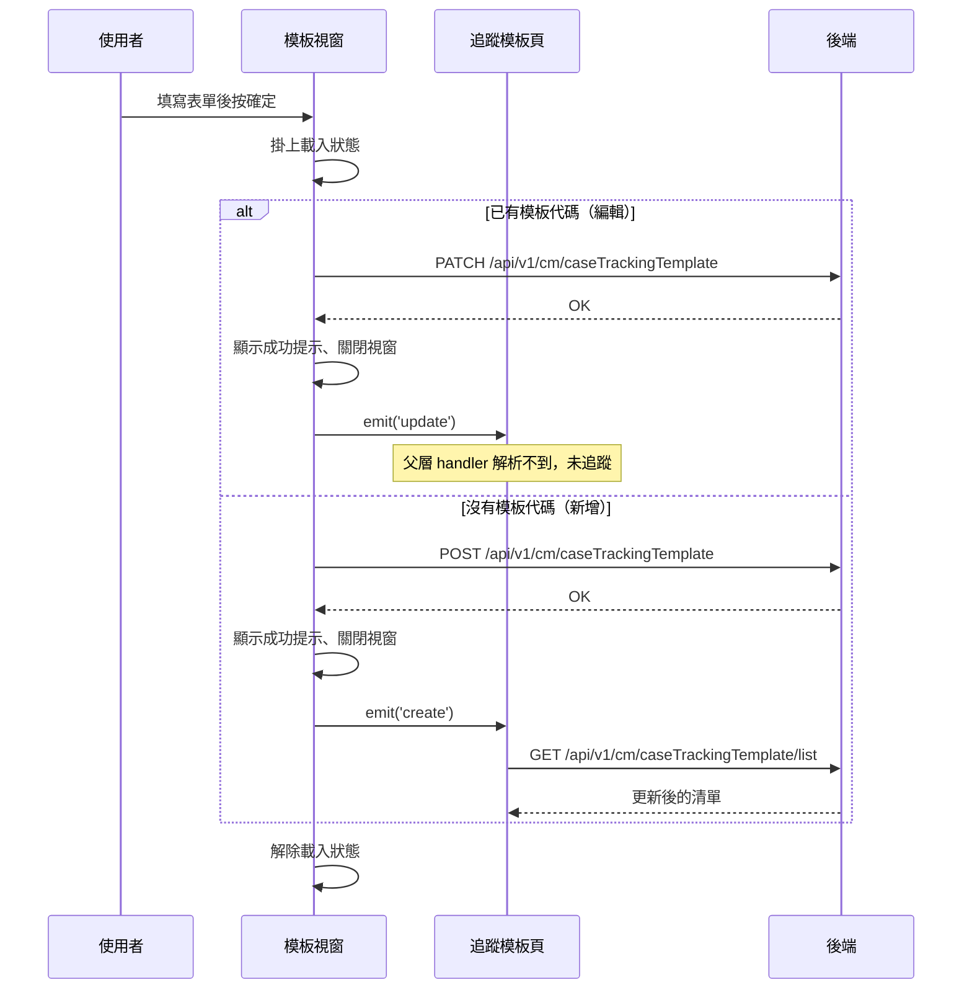

## 建立或編輯追蹤模板

**觸發**：追蹤模板頁的模板視窗按下確定
`src/views/Case/TrackingTemplate/components/TemplateModal.vue:189`

### 步驟

1. **判斷可否送出與走哪個分支** `src/views/Case/TrackingTemplate/components/TemplateModal.vue:119-124`
   模板資訊標為不可編輯（`canEdit` 為否）就什麼都不做；可編輯時，
   **有模板代碼走編輯、沒有走新增**。

2. **（編輯分支）送出更新請求** `src/api/case.ts:108`
   表單驗證通過後掛上載入狀態 `src/views/Case/TrackingTemplate/components/TemplateModal.vue:144`，
   `PATCH /api/v1/cm/caseTrackingTemplate`，帶模板代碼、標題與內容。

3. **（編輯分支）顯示成功提示、通知父層、關閉視窗** `src/views/Case/TrackingTemplate/components/TemplateModal.vue:149`
   發出 `update` 事件 `src/views/Case/TrackingTemplate/components/TemplateModal.vue:150`，
   由父層追蹤模板頁在 `src/views/Case/TrackingTemplate/IndexView.vue:223` 接手
   `updateList({ isDelete: false, pageInfo, callback: getCaseTrackingTemplateListHandler })`
   ——**這個父層 handler 解析不到，未展開**（見「未追蹤的部分」）。
   最後解除載入狀態 `src/views/Case/TrackingTemplate/components/TemplateModal.vue:153`。

4. **（新增分支）送出建立請求** `src/api/case.ts:104`
   表單驗證通過後掛上載入狀態 `src/views/Case/TrackingTemplate/components/TemplateModal.vue:130`，
   `POST /api/v1/cm/caseTrackingTemplate`，帶組織代碼、模板類型、標題與內容。
   沒有組織代碼就直接結束 `src/views/Case/TrackingTemplate/components/TemplateModal.vue:127-139`。

5. **（新增分支）顯示成功提示、通知父層重查、關閉視窗** `src/views/Case/TrackingTemplate/components/TemplateModal.vue:134`
   發出 `create` 事件 `src/views/Case/TrackingTemplate/components/TemplateModal.vue:135`，
   父層在 `src/views/Case/TrackingTemplate/IndexView.vue:221` 直接呼叫
   `getCaseTrackingTemplateListHandler()`，最後解除載入狀態
   `src/views/Case/TrackingTemplate/components/TemplateModal.vue:138`。

6. **（新增分支）父層重新查詢模板清單** `src/views/Case/TrackingTemplate/IndexView.vue:70-89`
   掛上載入狀態 `src/views/Case/TrackingTemplate/IndexView.vue:71`、
   把查詢條件同步到網址 `src/utils/composables/useQueryData.ts:106-146`
   （導航目標為執行期算出 `src/utils/composables/useQueryData.ts:145`）、
   捲動回頁面頂端 `src/views/Case/TrackingTemplate/IndexView.vue:76`，然後
   `GET /api/v1/cm/caseTrackingTemplate/list` `src/api/case.ts:90` 取回更新後的清單，
   完成後解除載入狀態 `src/views/Case/TrackingTemplate/IndexView.vue:88`。

### 序列圖

### 資料變化

| 對象 | 動作 | 位置 |
|---|---|---|
| `PATCH /api/v1/cm/caseTrackingTemplate` | **更新該筆模板**的標題與內容（編輯分支） | `src/api/case.ts:108` |
| `POST /api/v1/cm/caseTrackingTemplate` | **建立新模板**（新增分支） | `src/api/case.ts:104` |
| `GET /api/v1/cm/caseTrackingTemplate/list` | 唯讀，新增後重新取得清單 | `src/api/case.ts:90` |
| 網址 query | 寫入查詢條件（導航，重查時） | `src/utils/composables/useQueryData.ts:145` |
| 提示 Store | 新增成功提示 | `src/views/Case/TrackingTemplate/components/TemplateModal.vue:149` |
| 載入 Store | 掛上後解除 | `src/views/Case/TrackingTemplate/components/TemplateModal.vue:153` |

### 異常與補償

- **兩支寫入 API 都沒有 try／catch。** 失敗時錯誤往上拋，由全域的 API 回應攔截器
  統一顯示錯誤（見〈API 錯誤的全域處理〉）。
- **失敗時不會發出 `update`／`create` 事件**，清單不會被重查，視窗不會關閉，
  使用者可以直接重試。
- 載入狀態的解除 `src/views/Case/TrackingTemplate/components/TemplateModal.vue:153`
  在成功路徑上（不是 `finally`），失敗時**依賴攔截器最後的「清空載入狀態」安全網**。

### 未追蹤的部分

- 編輯成功後 `emit('update')` 對應的父層 handler
  `src/views/Case/TrackingTemplate/IndexView.vue:223` 的
  `updateList({ isDelete: false, pageInfo, callback: getCaseTrackingTemplateListHandler })`
  解析不到定義，未展開——編輯後清單如何刷新，這份封包追不到。
- 重查時網址導航的實際目標是執行期算出來的
  `src/utils/composables/useQueryData.ts:145`。

### 全域前置

這條流程的每次 API 呼叫都會經過〈每個請求送出前〉注入授權與語言標頭，
失敗時由〈API 錯誤的全域處理〉接手。此處不重述。
