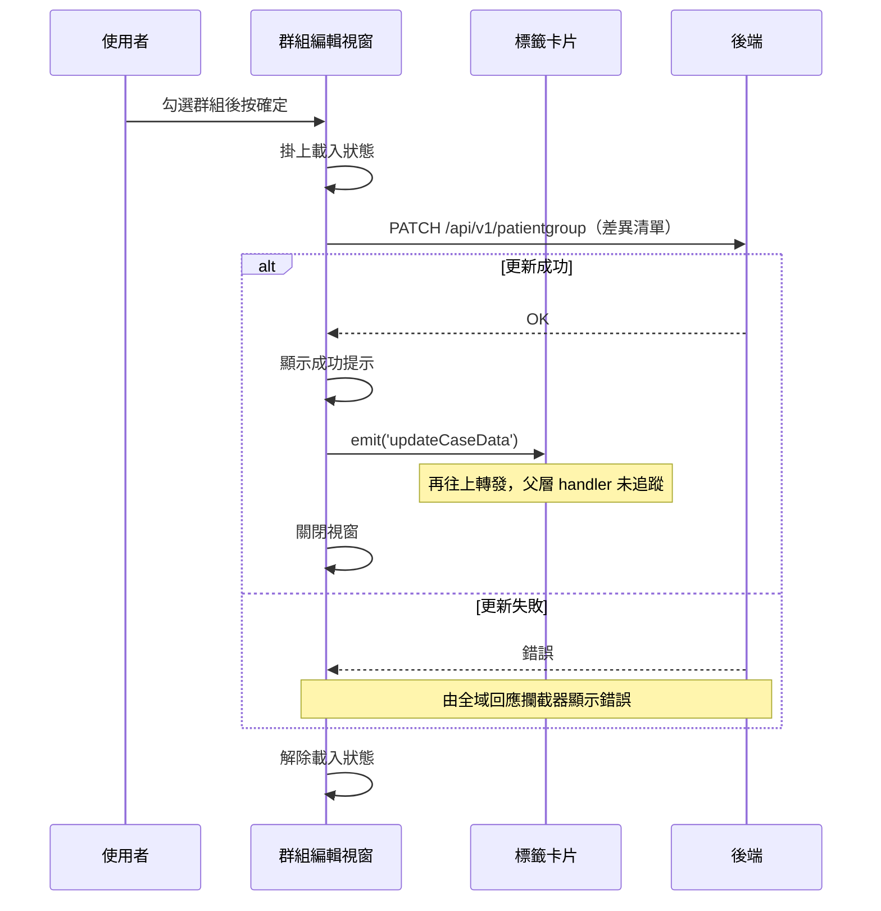

## 編輯個案所屬群組（個案管理頁）

**觸發**：個案管理頁的群組編輯視窗按下確定
`src/views/Case/_CaseGid/Management/components/PatientGroupLabel/components/Group/EditModal.vue:111`

### 步驟

1. **計算群組差異並送出更新** `src/views/Case/_CaseGid/Management/components/PatientGroupLabel/components/Group/EditModal.vue:85-102`
   掛上載入狀態 `src/views/Case/_CaseGid/Management/components/PatientGroupLabel/components/Group/EditModal.vue:89` 後，
   比較目前勾選的群組與個案原本所屬的群組，算出「新增的群組 ID」與「移除的群組 ID」，
   連同 caseGid 呼叫 `updateCasePatientGroup` `src/api/patientGroup.ts:146-148`
   → `PATCH /api/v1/patientgroup`（**寫入**）`src/api/patientGroup.ts:147`。
   後端拿到的是差異，不是完整清單。

2. **成功後顯示提示、通知父層、關閉視窗**
   `src/views/Case/_CaseGid/Management/components/PatientGroupLabel/components/Group/EditModal.vue:97`
   發出 `updateCaseData` 事件
   `src/views/Case/_CaseGid/Management/components/PatientGroupLabel/components/Group/EditModal.vue:98`。

3. **事件到達標籤卡片後再往上轉發**
   `src/views/Case/_CaseGid/Management/components/PatientGroupLabel/CardView.vue:160`
   只是 `$emit('updateCaseData')` 再往上丟，最終由誰重查個案資料，
   封包標「父層 handler 解析不到，未展開」（見未追蹤）。

4. **解除載入狀態** `src/views/Case/_CaseGid/Management/components/PatientGroupLabel/components/Group/EditModal.vue:101`
   寫在 `await` 之後，不在 `finally` 裡（見異常與補償）。

### 序列圖

### 資料變化

| 對象 | 動作 | 位置 |
|---|---|---|
| `PATCH /api/v1/patientgroup` | **更新個案所屬群組**（帶新增／移除差異） | `src/api/patientGroup.ts:147` |
| 提示 Store | 新增成功提示 | `src/views/Case/_CaseGid/Management/components/PatientGroupLabel/components/Group/EditModal.vue:97` |
| 載入 Store | 掛上後解除 | `src/views/Case/_CaseGid/Management/components/PatientGroupLabel/components/Group/EditModal.vue:101` |

### 異常與補償

- **PATCH 沒有 try／catch。** 失敗由全域 API 回應攔截器統一顯示錯誤
  （見〈API 錯誤的全域處理〉）。
- **失敗時不會發出 `updateCaseData`、不會關閉視窗**，使用者可直接重試。
- **解除載入狀態不在 `finally` 裡**
  `src/views/Case/_CaseGid/Management/components/PatientGroupLabel/components/Group/EditModal.vue:101`
  ——PATCH 失敗時這一行不會執行，依賴〈API 錯誤的全域處理〉的載入清空安全網。

### 未追蹤的部分

- `updateCaseData` 事件在標籤卡片
  `src/views/Case/_CaseGid/Management/components/PatientGroupLabel/CardView.vue:160`
  只是再往上轉發，父層 handler 解析不到，未展開——更新後畫面如何重新整理未追蹤。

### 全域前置

這條流程的 API 呼叫會經過〈每個請求送出前〉注入授權與語言標頭，
失敗時由〈API 錯誤的全域處理〉接手。此處不重述。
