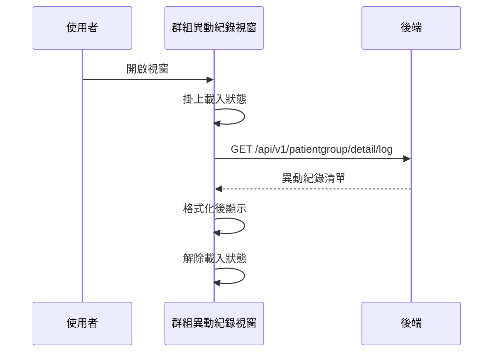

## 檢視個案群組異動紀錄

**觸發**：個案管理頁的群組異動紀錄視窗開啟時自動執行（視窗的 show 事件）
`src/views/Case/_CaseGid/Management/components/PatientGroupLabel/components/Group/LogModal.vue:84`

### 步驟

1. **初始化視窗並掛上載入狀態**
   `src/views/Case/_CaseGid/Management/components/PatientGroupLabel/components/Group/LogModal.vue:44-48`

2. **查詢該個案的群組異動紀錄**
   `src/views/Case/_CaseGid/Management/components/PatientGroupLabel/components/Group/LogModal.vue:52-67`
   帶 caseGid 呼叫 `getPatientGroupLog` `src/api/case.ts:71-77`
   → `GET /api/v1/patientgroup/detail/log`（讀取）`src/api/case.ts:74`。

3. **整理成畫面用的紀錄清單**
   `src/views/Case/_CaseGid/Management/components/PatientGroupLabel/components/Group/LogModal.vue:52-67`
   每筆取操作類型、群組名稱、操作者，時間以 dayjs 格式化後顯示。

4. **解除載入狀態**
   `src/views/Case/_CaseGid/Management/components/PatientGroupLabel/components/Group/LogModal.vue:47`

### 序列圖

### 資料變化

| 對象 | 動作 | 位置 |
|---|---|---|
| `GET /api/v1/patientgroup/detail/log` | 唯讀 | `src/api/case.ts:74` |
| 載入 Store | 掛上後解除 | `src/views/Case/_CaseGid/Management/components/PatientGroupLabel/components/Group/LogModal.vue:47` |

不改變任何後端資料。

### 異常與補償

沒有 try／catch。查詢失敗由全域 API 回應攔截器顯示錯誤（見〈API 錯誤的全域處理〉）。
載入狀態的解除寫在 `await` 之後
`src/views/Case/_CaseGid/Management/components/PatientGroupLabel/components/Group/LogModal.vue:47`，
失敗時依賴攔截器最後的「清空載入狀態」安全網。

### 全域前置

這條流程的 API 呼叫會經過〈每個請求送出前〉注入授權與語言標頭，
失敗時由〈API 錯誤的全域處理〉接手。此處不重述。
