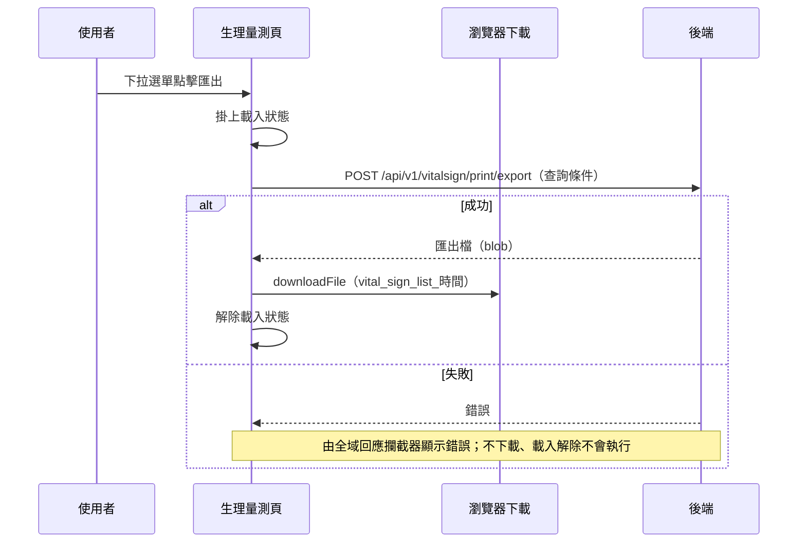

## 匯出生理量測紀錄

**觸發**：個案生理量測頁的下拉選單點擊匯出
`src/views/Case/_CaseGid/VitalSign/IndexView.vue:579`

### 步驟

1. **掛上載入狀態** `src/views/Case/_CaseGid/VitalSign/IndexView.vue:371`

2. **帶著目前的查詢條件請後端產出匯出檔** `src/api/vitalSign.ts:97`
   `POST /api/v1/vitalsign/print/export`，帶個案代碼、目前的查詢起訖時間與
   勾選的量測項目 `src/views/Case/_CaseGid/VitalSign/IndexView.vue:370-385`。
   雖然是 POST，這是**查詢型匯出**（封包標為讀取）——POST 只是承載查詢條件，
   後端以 blob 回傳檔案內容，不改變任何資料。

3. **把檔案交給瀏覽器下載** `src/views/Case/_CaseGid/VitalSign/IndexView.vue:382`
   以當下時間組出檔名 `vital_sign_list_<時間>`，交給共用層的 `downloadFile`
   觸發瀏覽器下載。

4. **解除載入狀態** `src/views/Case/_CaseGid/VitalSign/IndexView.vue:384`

### 序列圖

### 資料變化

| 對象 | 動作 | 位置 |
|---|---|---|
| `POST /api/v1/vitalsign/print/export` | 唯讀（查詢型匯出，POST 僅承載查詢條件） | `src/api/vitalSign.ts:97` |
| 瀏覽器下載 | 產生一個下載檔案（前端行為） | `src/views/Case/_CaseGid/VitalSign/IndexView.vue:382` |
| 載入 Store | 掛上，成功路徑上解除 | `src/views/Case/_CaseGid/VitalSign/IndexView.vue:384` |

不改變任何後端資料。

### 異常與補償

- **匯出 API 沒有 try／catch，也沒有 finally。** 失敗由全域的 API 回應攔截器統一
  顯示錯誤（見〈API 錯誤的全域處理〉），不會產生下載檔。
- **失敗時載入狀態的解除不會執行**：`removeLoadingKey`
  `src/views/Case/_CaseGid/VitalSign/IndexView.vue:384` 排在 `await` 之後
  而非 `finally`，得依賴全域錯誤處理的收尾（見〈API 錯誤的全域處理〉）。

### 未追蹤的部分

- `downloadFile` 位於共用層（src/utils/functions/browser.ts），封包未展開其內容，
  實際觸發下載的細節未追蹤。

### 全域前置

這條流程的 API 呼叫會經過〈每個請求送出前〉注入授權與語言標頭，
失敗時由〈API 錯誤的全域處理〉接手。此處不重述。
