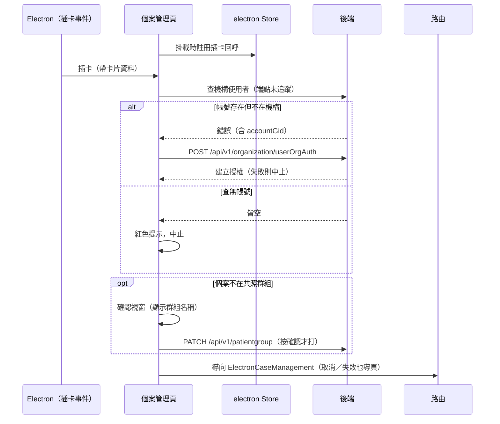

## 插入健保卡帶出個案（自動入機構、入群組）

**觸發**：Electron 個案管理頁掛載時，若路由帶有 `patientGroupId`，向 electron Store
註冊「健保卡插入」事件回呼 `src/views/Electron/Case/_CaseGid/Management/indexView.vue:165-170`。
之後每次插卡都會執行本流程——真正的業務動作發生在插卡當下，不是掛載當下。

### 步驟

1. **掛載時註冊插卡回呼** `src/views/Electron/Case/_CaseGid/Management/indexView.vue:165-170`
   先記下目前的共照群組 id `src/utils/composables/modules/electronWeb/useCardMonitor.ts:54-58`，
   再把 `onCardInserted` 推進 electron Store 的回呼清單
   `src/stores/electron.ts:134-136`。插卡事件由誰發出不在封包內（未追蹤）。

2. **插卡後先做兩道前置檢查** `src/utils/composables/modules/electronWeb/useCardMonitor.ts:67-89`
   卡片讀不到身分證號，或登入者沒有 `entryOrganizationId`，都以紅色提示中止
   （alert Store，數秒後自動消失 `src/stores/alert.ts:32-42`）。

3. **查這張卡在機構裡的身分** `src/utils/composables/modules/electronWeb/useCardMonitor.ts:96-106`
   以身分證號＋機構 id＋群組 id 呼叫 `fetchOrganizationUser`（解析不到定義，
   實際端點未追蹤）。查到就取得使用者資料；查詢失敗時呼叫 `e.preventDefault()`
   取消全域錯誤提示，改從錯誤清單裡撈「帳號存在但不在本機構」的 `accountGid`。

4. **不在機構 → 自動建立機構授權** `src/utils/composables/modules/electronWeb/useCardMonitor.ts:109-117`
   拿到 `notInOrgAccountGid` 時，呼叫 `POST /api/v1/organization/userOrgAuth`
   （**寫入**）以一般使用者角色把該帳號加入機構。失敗（`.catch(() => false)`）
   則整個流程靜默中止，不導頁。

5. **機構查詢與授權都落空 → 中止** `src/utils/composables/modules/electronWeb/useCardMonitor.ts:67-89`
   兩邊都拿不到 `accountGid` 代表共照雲查無此帳號，紅色提示後結束。

6. **不在共照群組 → 徵求同意後加入** `src/utils/composables/modules/electronWeb/useCardMonitor.ts:120-131`
   若不是「全機構」群組、且個案還不在群組裡，先取得群組名稱（快取沒有時呼叫
   `fetchPatientGroupSelectItems`，解析不到定義，端點未追蹤），彈出確認視窗；
   使用者按確認才呼叫 `PATCH /api/v1/patientgroup`（**寫入**）把個案加入這個共照群組
   `src/utils/composables/modules/electronWeb/useCardMonitor.ts:173-184`。

7. **導向該個案的管理頁** `src/utils/composables/modules/electronWeb/useCardMonitor.ts:160-171`
   以 `accountGid` 導向 `ElectronCaseManagement`（已在該頁則 `replace`，否則 `push`；
   封包標為動態導頁目標）。**注意：上一步的結果沒有被檢查**——使用者取消加入群組、
   或 PATCH 失敗，都照樣導頁 `src/utils/composables/modules/electronWeb/useCardMonitor.ts:88`。

   步驟 3、4、6 的查詢各自掛載入狀態並於 `finally` 解除。

### 序列圖

### 資料變化

| 對象 | 動作 | 位置 |
|---|---|---|
| `POST /api/v1/organization/userOrgAuth` | **寫入**：把卡片對應帳號以一般使用者角色加入機構 | `src/utils/composables/modules/electronWeb/useCardMonitor.ts:112` |
| `PATCH /api/v1/patientgroup` | **寫入**：把個案加入目前的共照群組 | `src/utils/composables/modules/electronWeb/useCardMonitor.ts:180` |
| electron Store | 註冊插卡事件回呼（掛載時一次） | `src/stores/electron.ts:134-136` |
| 提示 Store | 各中止情境的紅色提示 | `src/utils/composables/modules/electronWeb/useCardMonitor.ts:69`、`:72`、`:84` |
| 路由 | 導向 ElectronCaseManagement（動態目標） | `src/utils/composables/modules/electronWeb/useCardMonitor.ts:167`、`:169` |

### 異常與補償

- **機構使用者查詢自行 `catch` 並 `preventDefault()`**
  `src/utils/composables/modules/electronWeb/useCardMonitor.ts:96-106`：
  「不在機構」在這裡是預期分支而非錯誤，取消全域提示後轉入自動授權。
- **自動授權失敗靜默中止**：`.catch(() => false)` 只回傳失敗，流程不導頁、
  不另外提示 `src/utils/composables/modules/electronWeb/useCardMonitor.ts:109-117`。
- **群組名稱查詢失敗不擋流程**：`.catch(() => [])` 後名稱為空字串，確認視窗照開
  `src/utils/composables/modules/electronWeb/useCardMonitor.ts:134-148`。
- **加入群組的結果未被檢查**：`ensurePatientGroupJoinedHandler` 的回傳值被忽略
  `src/utils/composables/modules/electronWeb/useCardMonitor.ts:88`——取消或
  PATCH 失敗都照樣導頁，個案可能以「不在群組」的狀態進入管理頁，沒有補償。
- 三段查詢的載入狀態都在 `finally` 解除。

### 未追蹤的部分

- `fetchOrganizationUser` 與 `fetchPatientGroupSelectItems` 解析不到定義，
  實際呼叫的端點未追蹤（副作用彙總只列出上表兩支寫入 API）。
- 插卡事件的來源：回呼存進 electron Store 後由誰、何時觸發，不在封包內；
  封包裡也沒有對應的取消註冊。
- 兩處導頁標為**動態目標** `src/utils/composables/modules/electronWeb/useCardMonitor.ts:167`、`:169`
  （原始碼可見目標路由名為 `ElectronCaseManagement`）。
- 鏈中另有 19 個呼叫解析不到定義（多為內建方法）。

### 全域前置

API 呼叫會經過〈每個請求送出前〉注入授權與語言標頭；`preventDefault()` 取消全域
錯誤提示的機制見〈API 錯誤的全域處理〉。
