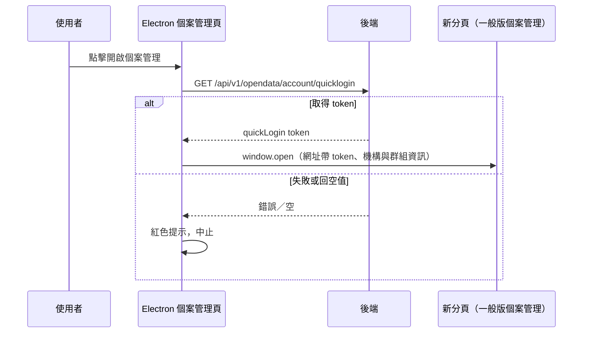

## 開新分頁進入一般版個案管理（快速登入）

**觸發**：Electron 個案管理頁按下按鈕
`src/views/Electron/Case/_CaseGid/Management/indexView.vue:178`

純查詢流程，不寫入任何後端資料；業務意義在**從 Electron 版跨到一般版**：
拿一次性快速登入 token，讓新分頁的一般版個案管理頁免重新登入。

### 步驟

1. **取得快速登入 token** `src/views/Electron/Case/_CaseGid/Management/indexView.vue:85-104`
   呼叫 `GET /api/v1/opendata/account/quicklogin`（讀取），期間掛載入狀態並於
   `finally` 解除。拿不到 token（API 失敗或回空值）就顯示紅色提示並中止，
   不開分頁。

2. **組一般版個案管理網址並開新分頁** `src/views/Electron/Case/_CaseGid/Management/indexView.vue:85-104`
   以 `CaseManagement` 路由（帶 `caseGid`）加上 query——機構 id、共照群組 id、
   機構代碼與剛取得的 `quickLogin`——解析出網址，`window.open` 開新分頁。
   本頁自身不導頁、狀態不變。

### 序列圖

### 資料變化

無後端寫入。

| 對象 | 動作 | 位置 |
|---|---|---|
| `GET /api/v1/opendata/account/quicklogin` | 唯讀，取得快速登入 token | `src/views/Electron/Case/_CaseGid/Management/indexView.vue:87` |
| 提示 Store | 失敗時紅色提示 | `src/views/Electron/Case/_CaseGid/Management/indexView.vue:92` |
| 瀏覽器 | 開新分頁到一般版 CaseManagement 路由 | `src/views/Electron/Case/_CaseGid/Management/indexView.vue:85-104` |

### 異常與補償

- **查詢自行 `.catch(() => '')`**：失敗與「回應沒有 token」走同一條路——紅色提示
  後中止，不開分頁，本頁狀態不變，使用者可重試
  `src/views/Electron/Case/_CaseGid/Management/indexView.vue:85-104`。
- 載入狀態在 `.finally()` 解除，成功失敗都會執行。

### 未追蹤的部分

- 新分頁開啟後、一般版個案管理頁如何消化 `quickLogin` 等 query，不在本封包內
  （屬 Case 域與全域前置守衛的範圍）。
- 鏈中另有 4 個呼叫解析不到定義（多為內建方法）。

### 全域前置

API 呼叫會經過〈每個請求送出前〉注入授權與語言標頭。
