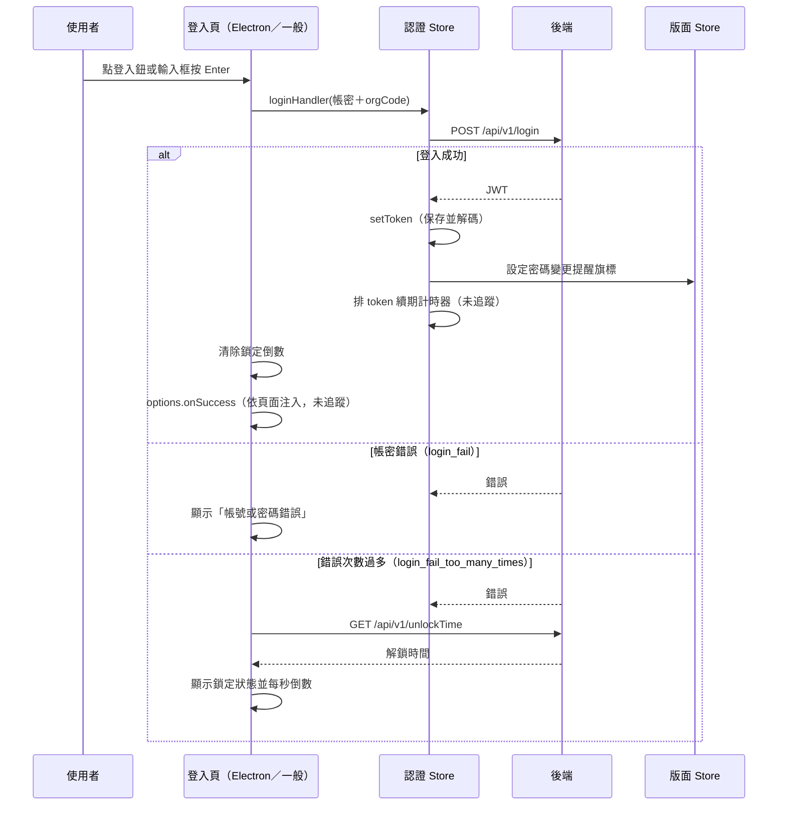

---
covers:
  - src/views/Electron/Login/IndexView.vue:128:UtilFormInput:keyup
  - src/views/Electron/Login/IndexView.vue:136:UtilPasswordInput:keyup
  - src/views/Login/Index/IndexView.vue:318:UtilFormInput:keyup
  - src/views/Login/Index/IndexView.vue:326:UtilPasswordInput:keyup
  - src/views/Login/Index/IndexView.vue:340:UtilButton:click
---

## 使用者帳密登入（Electron 與一般登入頁共用）

**觸發**：以下 6 個觸發點走同一條程式碼路徑，本章一次涵蓋——

- Electron 登入頁：登入按鈕 `src/views/Electron/Login/IndexView.vue:145`、
  帳號輸入框 Enter `src/views/Electron/Login/IndexView.vue:128`、
  密碼輸入框 Enter `src/views/Electron/Login/IndexView.vue:136`
- 一般登入頁：登入按鈕 `src/views/Login/Index/IndexView.vue:340`、
  帳號輸入框 Enter `src/views/Login/Index/IndexView.vue:318`、
  密碼輸入框 Enter `src/views/Login/Index/IndexView.vue:326`

### 步驟

1. **組登入資料並送出** `src/utils/composables/modules/auth/useLoginForm.ts:86-113`
   整個處理函式由 `handleSubmit` 包裝（其驗證行為封包解析不到，未追蹤）。掛上載入
   狀態後，把表單的帳密加上機構代碼（來自 organization store 的
   `organizationInfo?.orgCode`，沒有就空字串）組成登入資料。

2. **呼叫登入 API 並保存憑證** `src/stores/auth.ts:94-109`
   認證 Store 的 `loginHandler` 呼叫 `POST /api/v1/login`（**寫入**，try 保護內）
   `src/api/login.ts:19`，成功時：
   - `setToken` 保存 token 並解開 JWT `src/stores/auth.ts:175-178`；
   - 若 JWT 存在，依 `requirePasswordChange` 設定版面 Store 的密碼變更提醒視窗旗標
     `src/stores/layout.ts:66-68`（後續彈窗流程見 Login 篇章的「密碼變更提醒」兩章）；
   - 排一個計時器在 JWT 到期前重新取 token（`getTokenHandler`，不在本封包鏈內，
     未追蹤）`src/stores/auth.ts:107`。

3. **登入成功：清除鎖定狀態、交回頁面** `src/utils/composables/modules/auth/useLoginForm.ts:86-113`
   `stopUnlockCountdown` 停掉帳號鎖定倒數並清除鎖定旗標
   `src/utils/composables/modules/auth/useLoginForm.ts:152-158`，然後 `await
   options.onSuccess(...)`——成功後做什麼由掛載這個 composable 的頁面注入，
   封包未包含，未追蹤。

4. **登入失敗：轉成畫面上的具體錯誤** `src/utils/composables/modules/auth/useLoginForm.ts:86-113`
   依後端回傳的 `messageList` 分流：
   - `login_fail` → 設定「帳號或密碼錯誤」旗標；
   - `login_fail_too_many_times` → 進入下一步的鎖定倒數；
   - 之後執行 `validate()` 與 `options.onFail?.()`（皆解析不到／依頁面注入，未追蹤）。

5. **帳號被鎖定時：查解鎖時間並倒數** `src/utils/composables/modules/auth/useLoginForm.ts:117-126`
   `GET /api/v1/unlockTime`（讀取）取得帳號解鎖時間，`startUnlockCountdown`
   每秒重算剩餘秒數，歸零時自動清掉鎖定顯示
   `src/utils/composables/modules/auth/useLoginForm.ts:130-140`。這段查詢自己
   另掛一組載入狀態，於 `finally` 解除。

   最外層的載入狀態也在 `finally` 解除，成功失敗都會執行
   `src/utils/composables/modules/auth/useLoginForm.ts:112`。

### 序列圖

### 資料變化

| 對象 | 動作 | 位置 |
|---|---|---|
| `POST /api/v1/login` | **寫入**：送出帳密換取 JWT | `src/api/login.ts:19` |
| 認證 Store（token／jwt） | 保存新 token 並解碼 | `src/stores/auth.ts:175-178` |
| 版面 Store | 設定密碼變更提醒視窗旗標 | `src/stores/auth.ts:99` |
| `GET /api/v1/unlockTime` | 唯讀，取得帳號解鎖時間 | `src/utils/composables/modules/auth/useLoginForm.ts:119` |
| 載入 Store | 兩處掛上、皆於 finally 解除 | `src/utils/composables/modules/auth/useLoginForm.ts:87`、`:118` |

### 異常與補償

- **登入 API 在 try 保護內** `src/api/login.ts:11-31`，錯誤仍會 reject，由
  `login` 的 `.catch` 接手轉成欄位錯誤或鎖定倒數——失敗畫面停在登入頁，
  使用者可直接重試，沒有要回滾的狀態。
- **`GET /api/v1/unlockTime` 沒有自己的 `.catch`**
  `src/utils/composables/modules/auth/useLoginForm.ts:117-126`，失敗時載入狀態仍由
  `finally` 解除，錯誤沿 Promise 鏈往上（全域錯誤提示見全域前置的
  〈API 錯誤的全域處理〉）。
- 最外層載入狀態在 `.finally()` 解除，成功失敗都會執行
  `src/utils/composables/modules/auth/useLoginForm.ts:112`。

### 未追蹤的部分

- `options.onSuccess` ／ `options.onFail`：登入成敗後的頁面行為由各登入頁注入，
  封包未包含——Electron 登入頁與一般登入頁在這裡分岔，本章只能涵蓋到共用段為止。
- `handleSubmit` 與 `validate()`：表單驗證包裝，封包解析不到定義。
- `getTokenHandler`（token 續期）`src/stores/auth.ts:107`：只看得到排程，本體不在鏈內。
- 鏈中另有 12 個呼叫解析不到定義（多為內建方法）。

### 全域前置

API 呼叫會經過〈每個請求送出前〉注入授權與語言標頭；錯誤提示行為見
〈API 錯誤的全域處理〉。
