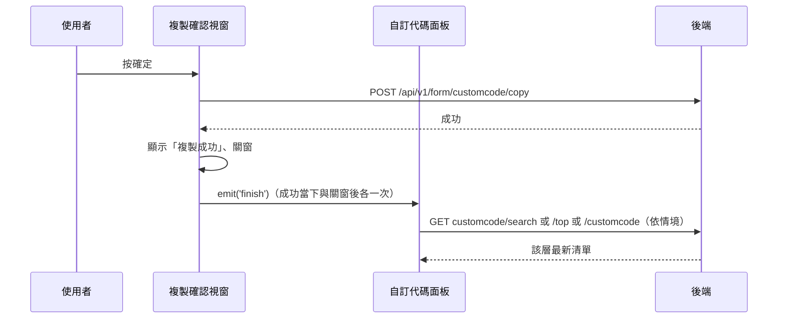

---
covers:
  - src/views/Form/CustomCode/components/CopyCustomCodeModal.vue:76:UtilModal:after-ok
---

## 複製自訂代碼

**觸發**：「複製自訂代碼」確認視窗按確定
`src/views/Form/CustomCode/components/CopyCustomCodeModal.vue:77`；
視窗關閉後的 `after-ok` `src/views/Form/CustomCode/components/CopyCustomCodeModal.vue:76`
是同一個動作的第二段（重查）。

### 步驟

1. **送出複製** `src/views/Form/CustomCode/components/CopyCustomCodeModal.vue:51-61`
   缺 id 或機構 ID 就顯示「id not found」錯誤提示並中止。
   帶來源代碼 `id` 與 `organizationId`
   → `POST /api/v1/form/customcode/copy`（**寫入**） `src/api/form.ts:520`。
   期間以視窗自己的載入鍵掛上載入狀態。

2. **成功後提示、發事件、關窗** `src/views/Form/CustomCode/components/CopyCustomCodeModal.vue:62-64`
   顯示「複製成功」，`emit('finish')`；視窗關閉後 `after-ok` 會再發一次 `finish`
   `src/views/Form/CustomCode/components/CopyCustomCodeModal.vue:76`，
   兩者都接到面板的 `finishCustomCodeHandle`
   `src/views/Form/CustomCode/components/CustomCodePanel.vue:254`。

3. **面板依情境重查受影響的那一層** `src/views/Form/CustomCode/components/CustomCodePanel.vue:108-119`
   - 搜尋模式中 → `GET /api/v1/form/customcode/search` `src/api/form.ts:508`
   - 頂層項目 → `GET /api/v1/form/customcode/top` `src/api/form.ts:464`
   - 一般子項目 → 重抓父節點子項 `GET /api/v1/form/customcode` `src/api/form.ts:473`

### 序列圖

### 資料變化

| 對象 | 動作 | 位置 |
|---|---|---|
| `POST /api/v1/form/customcode/copy` | **寫入**，複製代碼 | `src/api/form.ts:520` |
| `GET /api/v1/form/customcode/search`／`/top`／`/customcode` | 唯讀，寫入後重查（三擇一） | `src/api/form.ts:508` |
| 提示 Store | 成功／id not found 訊息 | `src/views/Form/CustomCode/components/CopyCustomCodeModal.vue:54` |
| 載入 Store | 視窗與面板各自掛上與解除 | `src/views/Form/CustomCode/components/CopyCustomCodeModal.vue:60` |

### 異常與補償

- 複製 API 沒有 try／catch，失敗由全域 API 回應攔截器統一顯示錯誤（見全域前置）；
  失敗時不提示、不關窗、不發事件，可直接重試。
  「解除載入狀態」在 `await` 之後，失敗時依賴攔截器安全網。
- 重查路徑（search／top）自帶 `finally` 解除各自的載入鍵。

### 全域前置

授權標頭注入與錯誤顯示見〈每個請求送出前〉與〈API 錯誤的全域處理〉。
