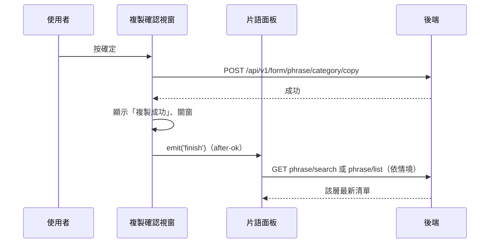

---
covers:
  - src/views/Form/CustomCode/components/CopyPhraseModal.vue:71:UtilModal:after-ok
---

## 複製片語分類（含底下片語）

**觸發**：「複製片語」確認視窗按確定
`src/views/Form/CustomCode/components/CopyPhraseModal.vue:72`；
視窗關閉後的 `after-ok` `src/views/Form/CustomCode/components/CopyPhraseModal.vue:71`
是同一個動作的第二段（重查）。

### 步驟

1. **送出複製** `src/views/Form/CustomCode/components/CopyPhraseModal.vue:44-57`
   缺 id 或機構 ID 就顯示「id not found」錯誤提示並中止。
   帶來源分類 `phraseCategoryId` 與 `organizationId`
   → `POST /api/v1/form/phrase/category/copy`（**寫入**，連同分類底下的片語一起複製）
   `src/views/Form/CustomCode/components/CopyPhraseModal.vue:57`。
   期間以視窗自己的載入鍵掛上載入狀態。

2. **成功後提示、關窗** `src/views/Form/CustomCode/components/CopyPhraseModal.vue:58-59`
   顯示「複製成功」。

3. **視窗關閉後發 finish，面板依情境重查** `src/views/Form/CustomCode/components/CopyPhraseModal.vue:71`
   `after-ok` 的 `emit('finish')` → 面板的 `finishPhraseHandle`
   `src/views/Form/CustomCode/components/PhraseCodePanel.vue:372`：
   - 搜尋模式中 → `GET /api/v1/form/phrase/search`
     `src/views/Form/CustomCode/components/PhraseCodePanel.vue:283`
   - 動到的是分類 → 重抓頂層分類清單 `GET /api/v1/form/phrase/list`
     `src/views/Form/CustomCode/components/PhraseCodePanel.vue:136`
   - 動到的是片語 → 重抓其所屬分類的片語（同一支 list API）

### 序列圖

### 資料變化

| 對象 | 動作 | 位置 |
|---|---|---|
| `POST /api/v1/form/phrase/category/copy` | **寫入**，複製分類與其片語 | `src/views/Form/CustomCode/components/CopyPhraseModal.vue:57` |
| `GET /api/v1/form/phrase/search`／`/list` | 唯讀，關窗後重查（依情境） | `src/views/Form/CustomCode/components/PhraseCodePanel.vue:283` |
| 提示 Store | 成功／id not found 訊息 | `src/views/Form/CustomCode/components/CopyPhraseModal.vue:47` |
| 載入 Store | 視窗與面板各自掛上與解除 | `src/views/Form/CustomCode/components/CopyPhraseModal.vue:56` |

### 異常與補償

- 複製 API 沒有 try／catch，失敗由全域 API 回應攔截器統一顯示錯誤（見全域前置）；
  失敗時不提示、不關窗（`after-ok` 也就不會發生），可直接重試。
  「解除載入狀態」在 `await` 之後，失敗時依賴攔截器安全網。

### 全域前置

授權標頭注入與錯誤顯示見〈每個請求送出前〉與〈API 錯誤的全域處理〉。
