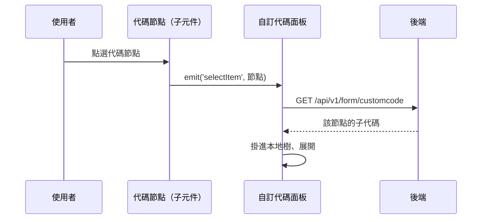

---
covers:
  - src/views/Form/CustomCode/components/CustomCode.vue:69:p:click
---

## 展開自訂代碼樹的子層

**觸發**：自訂代碼頁點選樹狀清單中的任一代碼節點（兩個點擊位置走同一條路徑）：

| 控件 | 位置 |
|---|---|
| 代碼節點 | `src/views/Form/CustomCode/components/CustomCode.vue:46` |
| 代碼節點（第二種呈現） | `src/views/Form/CustomCode/components/CustomCode.vue:69` |

自訂代碼是一棵**逐層載入**的樹：畫面上只有已展開的部分，點下去才向後端要子層。

### 步驟

1. **子元件把被點的節點往上發** `src/views/Form/CustomCode/components/CustomCode.vue:46`
   `emit('selectItem')` → 面板的 `selectCustomCodeItemHandle`
   `src/views/Form/CustomCode/components/CustomCodePanel.vue:220`。

2. **面板向後端取該節點的子項** `src/views/Form/CustomCode/components/CustomCodePanel.vue:121-133`
   節點沒有 id（樹根）直接略過。帶 `formCustomCodeId`
   → `GET /api/v1/form/customcode`（讀取） `src/api/form.ts:473`，
   在本地樹中找到對應節點，把回傳的子代碼掛上去。期間掛上載入狀態。

### 序列圖

### 資料變化

| 對象 | 動作 | 位置 |
|---|---|---|
| `GET /api/v1/form/customcode` | 唯讀，取節點子項 | `src/api/form.ts:473` |
| 載入 Store | 掛上與解除 | `src/views/Form/CustomCode/components/CustomCodePanel.vue:128` |

### 異常與補償

- 查詢沒有 try／catch，失敗由全域 API 回應攔截器統一顯示錯誤（見全域前置）；
  「解除載入狀態」在 `await` 之後，失敗時依賴攔截器安全網。樹維持原狀。

### 全域前置

授權標頭注入與錯誤顯示見〈每個請求送出前〉與〈API 錯誤的全域處理〉。
