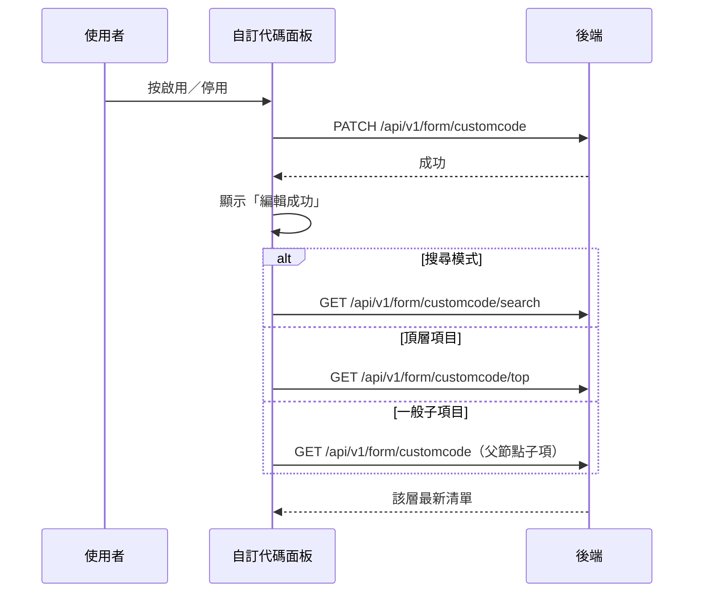

## 啟用／停用自訂代碼項目

**觸發**：自訂代碼面板上某個代碼項目的啟用切換鈕
`src/views/Form/CustomCode/components/CustomCodePanel.vue:227`

### 步驟

1. **反轉該項目的啟用狀態並送出** `src/views/Form/CustomCode/components/CustomCodePanel.vue:152-166`
   節點沒有 id 就顯示「id not found」提示並中止。
   帶整個節點內容、反轉後的 `isEnable` 與機構 ID
   → `PATCH /api/v1/form/customcode`（**寫入**） `src/api/form.ts:485`。
   期間掛上載入狀態。

2. **成功後提示，並依目前情境重查** `src/views/Form/CustomCode/components/CustomCodePanel.vue:108-119`
   顯示「編輯成功」，然後 `finishCustomCodeHandle` 依三種情境擇一重抓：
   - **搜尋模式中**（有關鍵字）→ 重跑搜尋
     `GET /api/v1/form/customcode/search` `src/api/form.ts:508`
   - **頂層項目**（無父節點）→ 重抓頂層清單
     `GET /api/v1/form/customcode/top` `src/api/form.ts:464`
   - **一般子項目** → 重抓其父節點的子項
     `GET /api/v1/form/customcode` `src/api/form.ts:473`

   三種情境都只重抓受影響的那一層，不整棵重載。

### 序列圖

### 資料變化

| 對象 | 動作 | 位置 |
|---|---|---|
| `PATCH /api/v1/form/customcode` | **寫入**，切換代碼啟用狀態 | `src/api/form.ts:485` |
| `GET /api/v1/form/customcode/search` | 唯讀，搜尋模式重查 | `src/api/form.ts:508` |
| `GET /api/v1/form/customcode/top` | 唯讀，頂層重查 | `src/api/form.ts:464` |
| `GET /api/v1/form/customcode` | 唯讀，父節點子項重查 | `src/api/form.ts:473` |
| 提示 Store | 成功／id not found 訊息 | `src/views/Form/CustomCode/components/CustomCodePanel.vue:154` |
| 載入 Store | 掛上與解除 | `src/views/Form/CustomCode/components/CustomCodePanel.vue:165` |

### 異常與補償

- 寫入 API 沒有 try／catch，失敗由全域 API 回應攔截器統一顯示錯誤（見全域前置）；
  失敗時不提示成功、不重查，樹維持原狀與後端一致，可直接重試。
  「解除載入狀態」在 `await` 之後，失敗時依賴攔截器安全網。
- 重查那一段（search／top）自帶 `finally` 解除各自的載入鍵。

### 全域前置

授權標頭注入與錯誤顯示見〈每個請求送出前〉與〈API 錯誤的全域處理〉。
