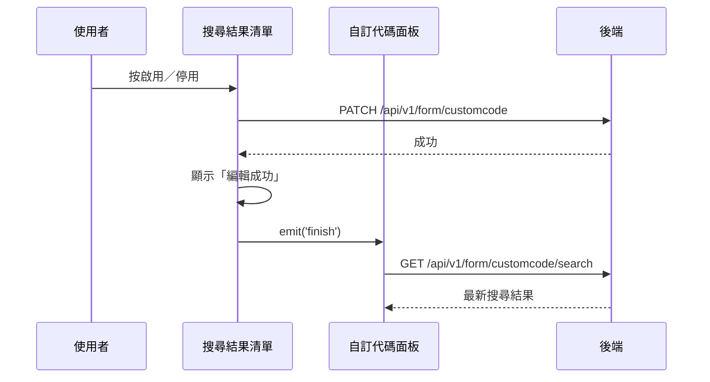

## 啟用／停用自訂代碼（搜尋結果清單）

**觸發**：自訂代碼搜尋結果清單中某筆項目的啟用切換鈕
`src/views/Form/CustomCode/components/DataList.vue:91`

與〈啟用／停用自訂代碼項目〉是同一支寫入 API，差別在入口：這裡是在**搜尋結果的
平面清單**上切換，成功後重跑的是搜尋，不是樹狀展開。

### 步驟

1. **反轉該筆的啟用狀態並送出** `src/views/Form/CustomCode/components/DataList.vue:49-61`
   缺 id 或機構 ID 就顯示「id not found」錯誤提示並中止。
   帶整筆內容與反轉後的 `isEnable`
   → `PATCH /api/v1/form/customcode`（**寫入**） `src/api/form.ts:485`。
   期間掛上載入狀態。

2. **成功後提示並通知面板重跑搜尋** `src/views/Form/CustomCode/components/DataList.vue:62-63`
   顯示「編輯成功」，`emit('finish')` → 面板的 `searchFormCustomCodeListFn`
   `src/views/Form/CustomCode/components/CustomCodePanel.vue:239`
   → `GET /api/v1/form/customcode/search`（讀取） `src/api/form.ts:508`，
   以原機構與原關鍵字重查，結果覆蓋搜尋清單。

### 序列圖

### 資料變化

| 對象 | 動作 | 位置 |
|---|---|---|
| `PATCH /api/v1/form/customcode` | **寫入**，切換代碼啟用狀態 | `src/api/form.ts:485` |
| `GET /api/v1/form/customcode/search` | 唯讀，寫入後重跑搜尋 | `src/api/form.ts:508` |
| 提示 Store | 成功／id not found 訊息 | `src/views/Form/CustomCode/components/DataList.vue:51` |
| 載入 Store | 掛上與解除 | `src/views/Form/CustomCode/components/DataList.vue:60` |

### 異常與補償

- 寫入 API 沒有 try／catch，失敗由全域 API 回應攔截器統一顯示錯誤（見全域前置）；
  失敗時不提示、不發事件、不重查，清單維持原狀與後端一致，可直接重試。
  「解除載入狀態」在 `await` 之後，失敗時依賴攔截器安全網。

### 全域前置

授權標頭注入與錯誤顯示見〈每個請求送出前〉與〈API 錯誤的全域處理〉。
