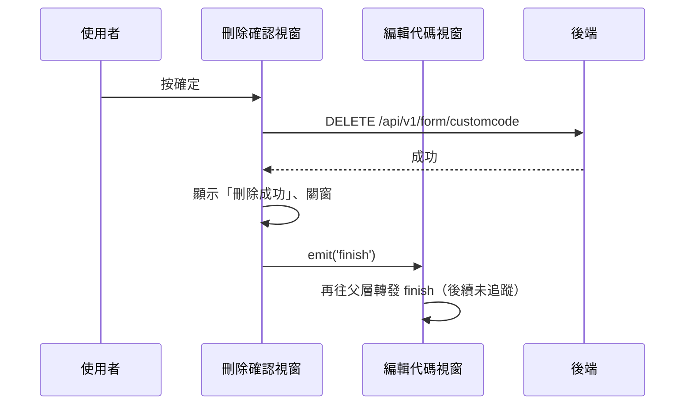

## 刪除自訂代碼

**觸發**：「刪除自訂代碼」確認視窗按確定
`src/views/Form/CustomCode/components/DeleteCustomCodeModal.vue:77`

### 步驟

1. **送出刪除** `src/views/Form/CustomCode/components/DeleteCustomCodeModal.vue:51-61`
   缺 id 或機構 ID 就顯示「id not found」錯誤提示並中止。
   帶 `id` 與 `organizationId`
   → `DELETE /api/v1/form/customcode`（**寫入**） `src/api/form.ts:490`。
   期間以視窗自己的載入鍵掛上載入狀態。

2. **成功後提示、發事件、關窗** `src/views/Form/CustomCode/components/DeleteCustomCodeModal.vue:62-64`
   顯示「刪除成功」，`emit('finish')` 往上傳。

### 序列圖

### 資料變化

| 對象 | 動作 | 位置 |
|---|---|---|
| `DELETE /api/v1/form/customcode` | **寫入**，刪除代碼 | `src/api/form.ts:490` |
| 提示 Store | 成功／id not found 訊息 | `src/views/Form/CustomCode/components/DeleteCustomCodeModal.vue:54` |
| 載入 Store | 掛上與解除 | `src/views/Form/CustomCode/components/DeleteCustomCodeModal.vue:60` |

### 異常與補償

- 刪除 API 沒有 try／catch，失敗由全域 API 回應攔截器統一顯示錯誤（見全域前置）；
  失敗時不關窗、不發事件，可直接重試。「解除載入狀態」在 `await` 之後，
  失敗時依賴攔截器安全網。

### 未追蹤的部分

- `finish` 事件由編輯代碼視窗 `src/views/Form/CustomCode/components/EditCustomCodeModal.vue:160`
  原樣往上轉發，**再上一層的 handler 解析不到**——刪除後清單如何刷新未追蹤。

### 全域前置

授權標頭注入與錯誤顯示見〈每個請求送出前〉與〈API 錯誤的全域處理〉。
