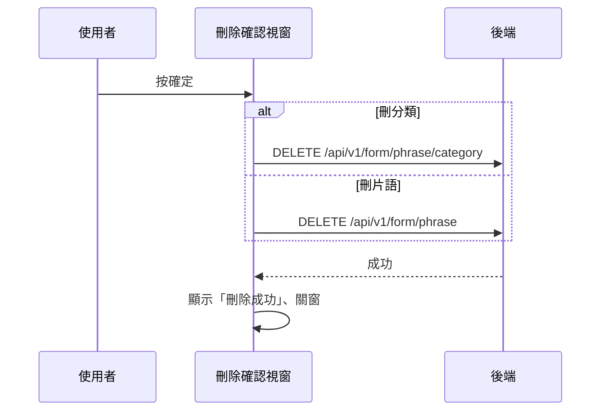

## 刪除片語或片語分類

**觸發**：「刪除片語」確認視窗按確定
`src/views/Form/CustomCode/components/DeletePhraseModal.vue:77`

同一個視窗依開啟時帶入的層級（`level`），刪的是**整個分類**或**單一片語**。

### 步驟

1. **依層級送出刪除** `src/views/Form/CustomCode/components/DeletePhraseModal.vue:45-62`
   缺 id 或機構 ID 就顯示「id not found」錯誤提示並中止。帶 `id` 與 `organizationId`：
   - `level === 'category'` → `DELETE /api/v1/form/phrase/category`（**寫入**）
     `src/views/Form/CustomCode/components/DeletePhraseModal.vue:60`
   - 否則 → `DELETE /api/v1/form/phrase`（**寫入**）
     `src/views/Form/CustomCode/components/DeletePhraseModal.vue:61`

   期間以視窗自己的載入鍵掛上載入狀態。

2. **成功後提示、關窗** `src/views/Form/CustomCode/components/DeletePhraseModal.vue:63-64`
   顯示「刪除成功」。**這個視窗沒有發任何事件**——鏈上看不到刪除後的清單刷新。

### 序列圖

### 資料變化

| 對象 | 動作 | 位置 |
|---|---|---|
| `DELETE /api/v1/form/phrase/category` | **寫入**，刪除片語分類 | `src/views/Form/CustomCode/components/DeletePhraseModal.vue:60` |
| `DELETE /api/v1/form/phrase` | **寫入**，刪除片語 | `src/views/Form/CustomCode/components/DeletePhraseModal.vue:61` |
| 提示 Store | 成功／id not found 訊息 | `src/views/Form/CustomCode/components/DeletePhraseModal.vue:48` |
| 載入 Store | 掛上與解除 | `src/views/Form/CustomCode/components/DeletePhraseModal.vue:57` |

### 異常與補償

- 刪除 API 沒有 try／catch，失敗由全域 API 回應攔截器統一顯示錯誤（見全域前置）；
  失敗時不提示、不關窗，可直接重試。「解除載入狀態」在 `await` 之後，
  失敗時依賴攔截器安全網。

### 未追蹤的部分

- 成功路徑上**沒有發事件、沒有重查**——刪除後畫面清單如何更新，封包裡看不到
  （可能由視窗關閉後的其他機制處理，未追蹤）。

### 全域前置

授權標頭注入與錯誤顯示見〈每個請求送出前〉與〈API 錯誤的全域處理〉。
