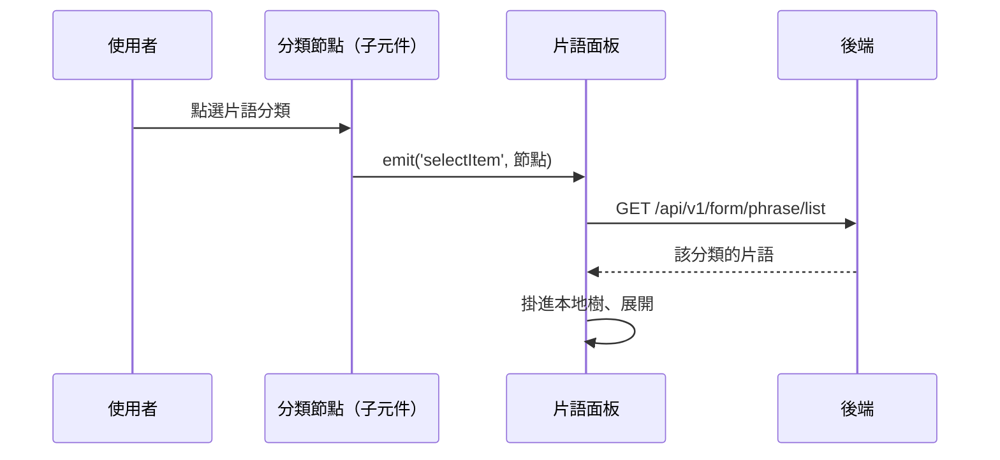

---
covers:
  - src/views/Form/CustomCode/components/PhraseCode.vue:73:p:click
---

## 展開片語分類的片語清單

**觸發**：片語頁點選樹狀清單中的分類節點（兩個點擊位置走同一條路徑）：

| 控件 | 位置 |
|---|---|
| 分類節點 | `src/views/Form/CustomCode/components/PhraseCode.vue:49` |
| 分類節點（第二種呈現） | `src/views/Form/CustomCode/components/PhraseCode.vue:73` |

片語樹只有兩層：**分類 → 片語**。點分類才向後端載入它底下的片語。

### 步驟

1. **子元件把被點的節點往上發** `src/views/Form/CustomCode/components/PhraseCode.vue:49`
   `emit('selectItem')` → 面板的 `selectPhraseItemHandle`
   `src/views/Form/CustomCode/components/PhraseCodePanel.vue:336`。

2. **面板向後端取該分類下的片語** `src/views/Form/CustomCode/components/PhraseCodePanel.vue:155-174`
   三種情況直接略過：節點沒有 id、被點的已是片語（有 `formPhraseCategoryId`）、
   或沒有機構 ID。否則帶機構與分類 ID
   → `GET /api/v1/form/phrase/list`（讀取）
   `src/views/Form/CustomCode/components/PhraseCodePanel.vue:166`，
   從回傳中找到該分類，把它的片語掛進本地樹。期間掛上載入狀態。

### 序列圖

### 資料變化

| 對象 | 動作 | 位置 |
|---|---|---|
| `GET /api/v1/form/phrase/list` | 唯讀，取分類下片語 | `src/views/Form/CustomCode/components/PhraseCodePanel.vue:166` |
| 載入 Store | 掛上與解除 | `src/views/Form/CustomCode/components/PhraseCodePanel.vue:165` |

### 異常與補償

- 查詢沒有 try／catch，失敗由全域 API 回應攔截器統一顯示錯誤（見全域前置）；
  「解除載入狀態」在 `await` 之後，失敗時依賴攔截器安全網。樹維持原狀。

### 全域前置

授權標頭注入與錯誤顯示見〈每個請求送出前〉與〈API 錯誤的全域處理〉。
