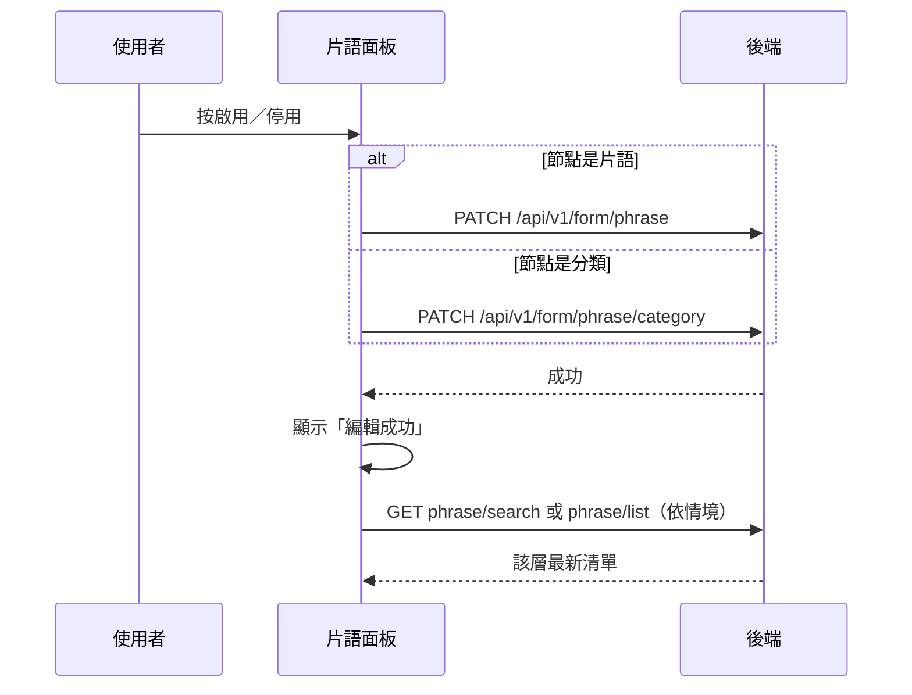

## 啟用／停用片語或片語分類

**觸發**：片語面板上某個節點的啟用切換鈕
`src/views/Form/CustomCode/components/PhraseCodePanel.vue:343`

同一顆按鈕依被點的節點是**片語**還是**分類**，走兩支不同的寫入 API。

### 步驟

1. **判斷節點類型、反轉啟用狀態並送出** `src/views/Form/CustomCode/components/PhraseCodePanel.vue:221-241`
   缺 id 或機構 ID 就顯示「id not found」錯誤提示並中止。
   - 節點有 `formPhraseCategoryId`（是片語）
     → `PATCH /api/v1/form/phrase`（**寫入**）
     `src/views/Form/CustomCode/components/PhraseCodePanel.vue:230`
   - 否則（是分類）
     → `PATCH /api/v1/form/phrase/category`（**寫入**）
     `src/views/Form/CustomCode/components/PhraseCodePanel.vue:237`

   期間掛上載入狀態。

2. **成功後提示，並依情境重查** `src/views/Form/CustomCode/components/PhraseCodePanel.vue:317-326`
   顯示「編輯成功」，`finishPhraseHandle` 擇一重抓：
   - 搜尋模式中 → `GET /api/v1/form/phrase/search`
     `src/views/Form/CustomCode/components/PhraseCodePanel.vue:283`
   - 動到的是分類 → 重抓頂層分類清單 `GET /api/v1/form/phrase/list`
     `src/views/Form/CustomCode/components/PhraseCodePanel.vue:136`
   - 動到的是片語 → 重抓其所屬分類的片語（同一支 list API，帶分類 ID）；
     本地樹找不到該分類時退回重抓頂層。

### 序列圖

### 資料變化

| 對象 | 動作 | 位置 |
|---|---|---|
| `PATCH /api/v1/form/phrase` | **寫入**，切換片語啟用狀態 | `src/views/Form/CustomCode/components/PhraseCodePanel.vue:230` |
| `PATCH /api/v1/form/phrase/category` | **寫入**，切換分類啟用狀態 | `src/views/Form/CustomCode/components/PhraseCodePanel.vue:237` |
| `GET /api/v1/form/phrase/search`／`/list` | 唯讀，寫入後重查（依情境） | `src/views/Form/CustomCode/components/PhraseCodePanel.vue:283` |
| 提示 Store | 成功／id not found 訊息 | `src/views/Form/CustomCode/components/PhraseCodePanel.vue:223` |
| 載入 Store | 掛上與解除 | `src/views/Form/CustomCode/components/PhraseCodePanel.vue:227` |

### 異常與補償

- 寫入 API 沒有 try／catch，失敗由全域 API 回應攔截器統一顯示錯誤（見全域前置）；
  失敗時不提示、不重查，樹維持原狀與後端一致，可直接重試。
  「解除載入狀態」在 `await` 之後，失敗時依賴攔截器安全網。
- 重查路徑自帶 `finally` 解除各自的載入鍵。

### 全域前置

授權標頭注入與錯誤顯示見〈每個請求送出前〉與〈API 錯誤的全域處理〉。
