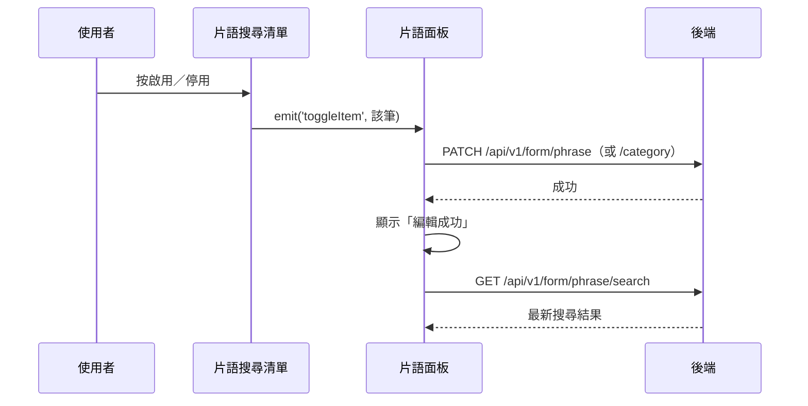

## 啟用／停用片語（搜尋結果清單）

**觸發**：片語搜尋結果清單中某筆項目的啟用切換鈕
`src/views/Form/CustomCode/components/PhraseDataList.vue:46`

與〈啟用／停用片語或片語分類〉是同一條寫入路徑，差別在入口：搜尋結果是平面清單，
子元件先把該筆資料包成樹節點再交給面板處理。

### 步驟

1. **子元件把被點的項目往上發** `src/views/Form/CustomCode/components/PhraseDataList.vue:46`
   `emit('toggleItem')` → 面板的 `togglePhraseSearchItemHandle`
   `src/views/Form/CustomCode/components/PhraseCodePanel.vue:355`，
   把搜尋結果那筆包成節點格式 `src/views/Form/CustomCode/components/PhraseCodePanel.vue:304-315`。

2. **依節點類型送出啟用切換** `src/views/Form/CustomCode/components/PhraseCodePanel.vue:221-241`
   片語 → `PATCH /api/v1/form/phrase`（**寫入**）
   `src/views/Form/CustomCode/components/PhraseCodePanel.vue:230`；
   分類 → `PATCH /api/v1/form/phrase/category`（**寫入**）
   `src/views/Form/CustomCode/components/PhraseCodePanel.vue:237`。
   期間掛上載入狀態。

3. **成功後提示並重跑搜尋** `src/views/Form/CustomCode/components/PhraseCodePanel.vue:317-318`
   顯示「編輯成功」；因為處於搜尋模式，重查走
   `GET /api/v1/form/phrase/search`（讀取）
   `src/views/Form/CustomCode/components/PhraseCodePanel.vue:283`，結果覆蓋搜尋清單。

### 序列圖

### 資料變化

| 對象 | 動作 | 位置 |
|---|---|---|
| `PATCH /api/v1/form/phrase`／`/category` | **寫入**，切換啟用狀態（二擇一） | `src/views/Form/CustomCode/components/PhraseCodePanel.vue:230` |
| `GET /api/v1/form/phrase/search` | 唯讀，寫入後重跑搜尋 | `src/views/Form/CustomCode/components/PhraseCodePanel.vue:283` |
| 提示 Store | 成功／id not found 訊息 | `src/views/Form/CustomCode/components/PhraseCodePanel.vue:223` |
| 載入 Store | 掛上與解除 | `src/views/Form/CustomCode/components/PhraseCodePanel.vue:227` |

### 異常與補償

同〈啟用／停用片語或片語分類〉：寫入沒有 try／catch，失敗由全域攔截器顯示錯誤，
不重查、清單維持原狀；「解除載入狀態」在 `await` 之後，失敗時依賴攔截器安全網。

### 全域前置

授權標頭注入與錯誤顯示見〈每個請求送出前〉與〈API 錯誤的全域處理〉。
