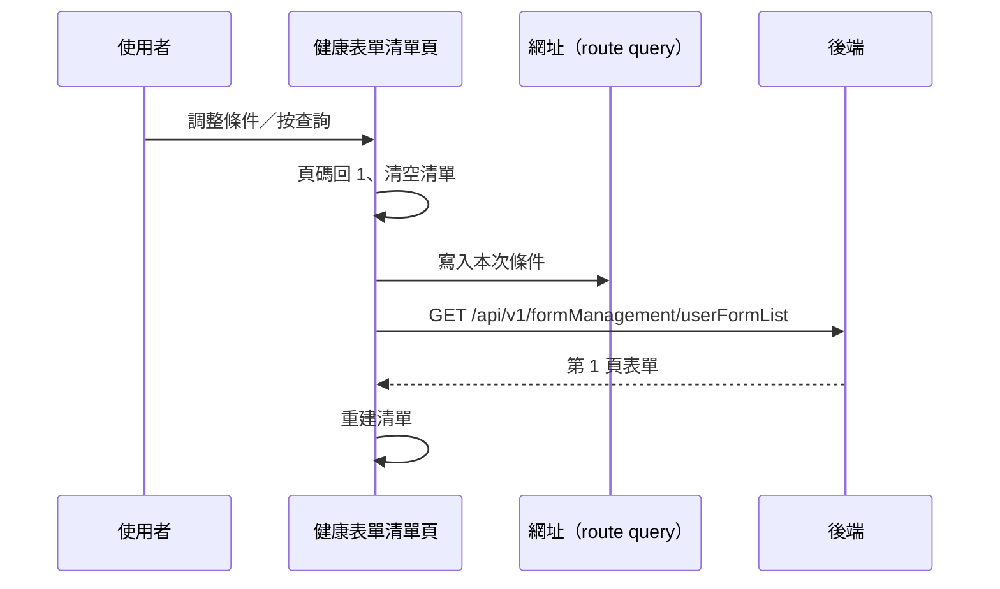

---
covers:
  - src/views/Form/HealthForm/Index/IndexView.vue:129:UtilFormSelect:change
  - src/views/Form/HealthForm/Index/IndexView.vue:135:UtilFormInput:clear
  - src/views/Form/HealthForm/Index/IndexView.vue:136:UtilFormInput:keyup
---

## 查詢健康表單清單（變更條件重查）

**觸發**：民眾端健康表單清單頁上**四個**控件都走這條路徑：

| 控件 | 位置 |
|---|---|
| 查詢鈕 | `src/views/Form/HealthForm/Index/IndexView.vue:139` |
| 機構下拉 | `src/views/Form/HealthForm/Index/IndexView.vue:129` |
| 關鍵字清空 | `src/views/Form/HealthForm/Index/IndexView.vue:135` |
| 關鍵字輸入按 Enter | `src/views/Form/HealthForm/Index/IndexView.vue:136` |

這頁用無限捲動（見〈健康表單清單的無限捲動載入〉），所以變更條件時要**清空清單、
回到第 1 頁**重新累積。

### 步驟

1. **重設頁碼並清空清單** `src/views/Form/HealthForm/Index/IndexView.vue:109-112`
   頁碼回 1、清空已載入的表單，讓後續查詢從頭累積。

2. **同步條件到網址、帶條件查詢** `src/views/Form/HealthForm/Index/IndexView.vue:70-83`
   條件寫回網址 query `src/utils/composables/useQueryData.ts:145`（可分享、可重整），
   → `GET /api/v1/formManagement/userFormList`（讀取） `src/api/form.ts:527`，
   結果附加進剛清空的清單（等於整批重建）。期間掛上載入狀態。

### 序列圖

### 資料變化

| 對象 | 動作 | 位置 |
|---|---|---|
| `GET /api/v1/formManagement/userFormList` | 唯讀 | `src/api/form.ts:527` |
| 網址 query | 寫入查詢條件 | `src/utils/composables/useQueryData.ts:145` |
| 載入 Store | 掛上與解除 | `src/views/Form/HealthForm/Index/IndexView.vue:71` |

### 異常與補償

- 查詢沒有 try／catch，失敗由全域 API 回應攔截器統一顯示錯誤（見全域前置）；
  「解除載入狀態」在 `await` 之後，失敗時依賴攔截器安全網。
  **注意**：清單在查詢前就被清空，失敗時畫面會停在空清單（不是保留舊資料）。

### 全域前置

授權標頭注入與錯誤顯示見〈每個請求送出前〉與〈API 錯誤的全域處理〉。
