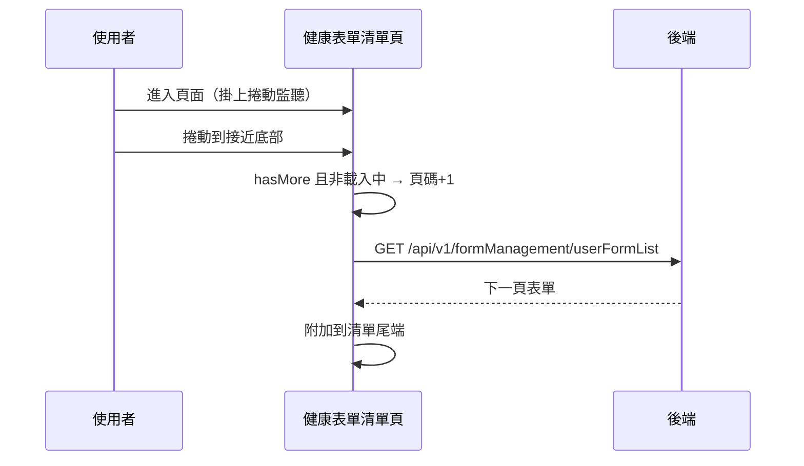

## 健康表單清單的無限捲動載入

**觸發**：進入民眾端健康表單清單頁時掛上捲動監聽
`src/views/Form/HealthForm/Index/IndexView.vue:46`；
實際查詢發生在**清單捲到接近底部**時。

這頁不用分頁控件，用無限捲動：每次捲近底部就抓下一頁**附加**在清單後面。

### 步驟

1. **頁面掛載時註冊捲動監聽** `src/views/Form/HealthForm/Index/IndexView.vue:46-50`
   對版面容器掛 `scroll` 監聽；找不到容器元素就直接放棄（不掛監聽，也就不會載入更多）。

2. **捲動接近底部時載入下一頁** `src/views/Form/HealthForm/Index/IndexView.vue:51-54`
   三個條件同時成立才觸發：距底部不到 30px、後端說還有更多（`hasMore`）、
   目前不在載入中。頁碼加一後查詢。

3. **帶條件查詢並附加結果** `src/views/Form/HealthForm/Index/IndexView.vue:70-83`
   先把查詢條件同步到網址 `src/utils/composables/useQueryData.ts:145`，再帶機構、
   頁碼、關鍵字 → `GET /api/v1/formManagement/userFormList`（讀取） `src/api/form.ts:527`，
   回傳**附加**到既有清單之後，並更新「還有沒有更多」。期間掛上載入狀態。

### 序列圖

### 資料變化

| 對象 | 動作 | 位置 |
|---|---|---|
| `GET /api/v1/formManagement/userFormList` | 唯讀 | `src/api/form.ts:527` |
| 網址 query | 寫入查詢條件 | `src/utils/composables/useQueryData.ts:145` |
| 載入 Store | 掛上與解除；也作為防重複觸發的閘 | `src/views/Form/HealthForm/Index/IndexView.vue:71` |

### 異常與補償

- 查詢沒有 try／catch，失敗由全域 API 回應攔截器統一顯示錯誤（見全域前置）；
  「解除載入狀態」在 `await` 之後，失敗時依賴攔截器安全網。
  已載入的清單不受影響；但**頁碼已加一**，失敗的那一頁不會自動重試。

### 全域前置

授權標頭注入與錯誤顯示見〈每個請求送出前〉與〈API 錯誤的全域處理〉。
