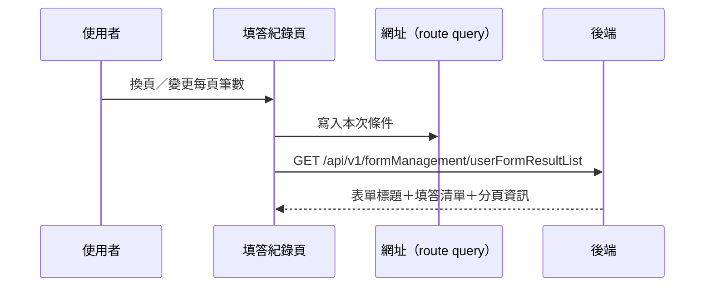

---
covers:
  - src/views/Form/HealthForm/Record/RecordView.vue:154:UtilTable:change-page
---

## 查詢個人填答紀錄

**觸發**：民眾端健康表單「填答紀錄」頁的表格控件（兩個入口走同一條路徑）：

| 控件 | 位置 |
|---|---|
| 變更每頁筆數 | `src/views/Form/HealthForm/Record/RecordView.vue:153` |
| 換頁 | `src/views/Form/HealthForm/Record/RecordView.vue:154` |

### 步驟

1. **決定頁碼、同步條件到網址** `src/views/Form/HealthForm/Record/RecordView.vue:80-83`
   換頁帶著頁碼進來會先從網址讀回既有條件；變更每頁筆數則重設回第 1 頁。
   條件寫回網址 query `src/utils/composables/useQueryData.ts:145`。

2. **帶條件查詢填答紀錄** `src/views/Form/HealthForm/Record/RecordView.vue:84-95`
   帶表單 `formGuid`、使用者 `userGid` 與分頁
   → `GET /api/v1/formManagement/userFormResultList`（讀取） `src/api/form.ts:536`。
   回傳同時更新頁面標題（表單名稱）、是否顯示分數，與填答清單。
   期間掛上載入狀態。

### 序列圖

### 資料變化

| 對象 | 動作 | 位置 |
|---|---|---|
| `GET /api/v1/formManagement/userFormResultList` | 唯讀 | `src/api/form.ts:536` |
| 網址 query | 寫入查詢條件 | `src/utils/composables/useQueryData.ts:145` |
| 載入 Store | 掛上與解除 | `src/views/Form/HealthForm/Record/RecordView.vue:79` |

### 異常與補償

- 查詢沒有 try／catch，失敗由全域 API 回應攔截器統一顯示錯誤（見全域前置）；
  「解除載入狀態」在 `await` 之後，失敗時依賴攔截器安全網。清單維持前一次內容。

### 全域前置

授權標頭注入與錯誤顯示見〈每個請求送出前〉與〈API 錯誤的全域處理〉。
