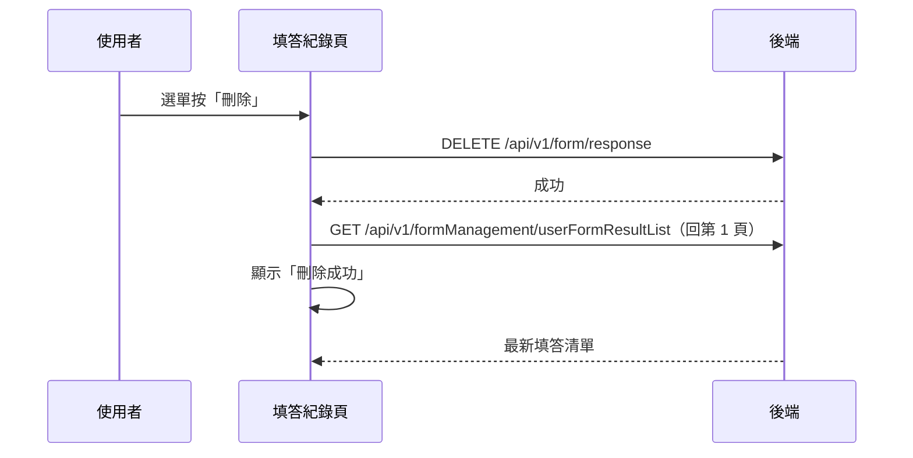

## 刪除個人填答紀錄

**觸發**：填答紀錄清單某筆紀錄的下拉選單按「刪除」
`src/views/Form/HealthForm/Record/RecordView.vue:195`

### 步驟

1. **送出刪除** `src/views/Form/HealthForm/Record/RecordView.vue:132-135`
   帶該筆填答的 `responseId`
   → `DELETE /api/v1/form/response`（**寫入**） `src/api/form.ts:358`。
   期間掛上載入狀態。

2. **成功後重查清單、顯示「刪除成功」** `src/views/Form/HealthForm/Record/RecordView.vue:135-136`
   先觸發重查、隨即提示。重查不帶頁碼，**回到第 1 頁**
   `src/views/Form/HealthForm/Record/RecordView.vue:81`，
   走〈查詢個人填答紀錄〉同一條路徑
   → `GET /api/v1/formManagement/userFormResultList` `src/api/form.ts:536`。

### 序列圖

### 資料變化

| 對象 | 動作 | 位置 |
|---|---|---|
| `DELETE /api/v1/form/response` | **寫入**，刪除填答紀錄 | `src/api/form.ts:358` |
| `GET /api/v1/formManagement/userFormResultList` | 唯讀，刪除後重查（回第 1 頁） | `src/api/form.ts:536` |
| 提示 Store | 顯示成功訊息 | `src/views/Form/HealthForm/Record/RecordView.vue:136` |
| 載入 Store | 掛上與解除 | `src/views/Form/HealthForm/Record/RecordView.vue:133` |

### 異常與補償

- 刪除 API 沒有 try／catch，失敗由全域 API 回應攔截器統一顯示錯誤（見全域前置）；
  失敗時不重查、不提示，清單維持原狀與後端一致，可直接重試。
  「解除載入狀態」在 `await` 之後，失敗時依賴攔截器安全網。
- 與〈刪除表單〉不同，這裡的重查**不做「最後一頁只剩一筆就退頁」的調整**，
  一律回到第 1 頁。

### 全域前置

授權標頭注入與錯誤顯示見〈每個請求送出前〉與〈API 錯誤的全域處理〉。
