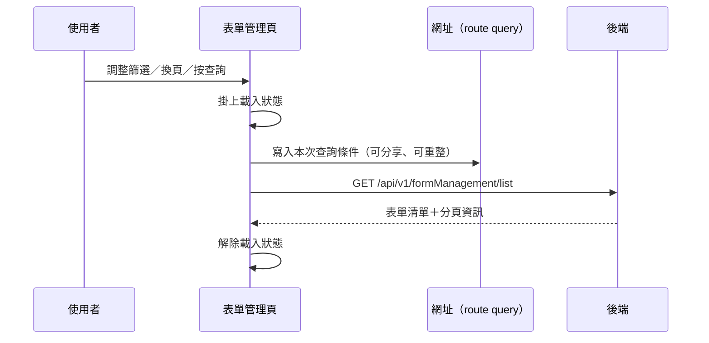

---
covers:
  - src/views/Form/Management/IndexView.vue:308:UtilSearchSelect:change
  - src/views/Form/Management/IndexView.vue:316:UtilFormInput:clear
  - src/views/Form/Management/IndexView.vue:317:UtilFormInput:keyup
  - src/views/Form/Management/IndexView.vue:330:UtilFormSelect:change
  - src/views/Form/Management/IndexView.vue:353:UtilTable:change-limit
  - src/views/Form/Management/IndexView.vue:354:UtilTable:change-page
---

## 查詢表單清單

**觸發**：表單管理頁上**七個**控件都走這條路徑，是同一個查詢動作的不同入口：

| 控件 | 位置 |
|---|---|
| 查詢鈕 | `src/views/Form/Management/IndexView.vue:320` |
| 機構搜尋下拉 | `src/views/Form/Management/IndexView.vue:308` |
| 關鍵字清空 | `src/views/Form/Management/IndexView.vue:316` |
| 關鍵字輸入按 Enter | `src/views/Form/Management/IndexView.vue:317` |
| 表單類型下拉 | `src/views/Form/Management/IndexView.vue:330` |
| 變更每頁筆數 | `src/views/Form/Management/IndexView.vue:353` |
| 換頁 | `src/views/Form/Management/IndexView.vue:354` |

### 步驟

1. **掛上載入狀態** `src/views/Form/Management/IndexView.vue:84`

2. **決定頁碼、把查詢條件同步到網址** `src/views/Form/Management/IndexView.vue:85-87`
   換頁時帶著頁碼進來，會先從網址讀回既有條件 `src/utils/composables/useQueryData.ts:102-104`；
   其他控件（改篩選、按查詢、清關鍵字）一律把頁碼重設回第 1 頁。
   接著把本次條件寫回網址 query `src/utils/composables/useQueryData.ts:145`，
   所以篩選結果可以複製網址分享、重新整理不會遺失條件。

3. **捲回頁面頂端，帶條件查詢清單** `src/views/Form/Management/IndexView.vue:88-98`
   → `GET /api/v1/formManagement/list` `src/api/form.ts:58`，
   條件含機構、關鍵字、表單類型與分頁，回傳結果寫入畫面的表單清單與分頁資訊。

4. **解除載入狀態** `src/views/Form/Management/IndexView.vue:100`

### 序列圖

### 資料變化

| 對象 | 動作 | 位置 |
|---|---|---|
| `GET /api/v1/formManagement/list` | 唯讀 | `src/api/form.ts:58` |
| 網址 query | 寫入查詢條件 | `src/utils/composables/useQueryData.ts:145` |
| 載入 Store | 掛上與解除 | `src/views/Form/Management/IndexView.vue:84` |

### 異常與補償

- API 層的 `getFormList` 有 try／catch，但 catch 只把錯誤原樣往外拋
  `src/api/form.ts:11-80`；元件層沒有再接，錯誤由全域 API 回應攔截器統一顯示。
- 查詢失敗時 `await` 中斷在 API 那一步，之後的「解除載入狀態」
  `src/views/Form/Management/IndexView.vue:100` 不會執行，
  依賴攔截器的清空載入狀態安全網（見全域前置）；清單維持前一次內容。

### 全域前置

授權標頭注入與錯誤顯示見〈每個請求送出前〉與〈API 錯誤的全域處理〉。
